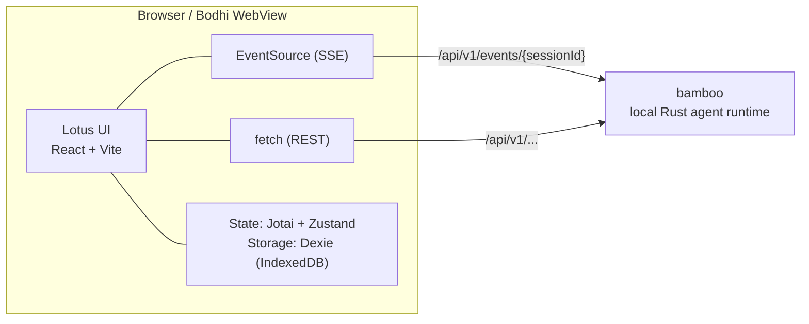

# Lotus — The Living Interface 莲花交互层

> React + Vite UI layer for Zenith · `@bigduu/lotus`

---

## 1. 这是什么 / What this is

**中文：** Lotus 是你和 AI 智能体对话的那块「玻璃」。你打字、它回答——但更重要的是，你能**看见它在想什么、在做什么**：它正在读哪个文件、调用哪个工具、列了什么待办清单、画了什么流程图，全部实时呈现在屏幕上。它把一个原本黑箱的 AI，变成一个透明、可观察、可随时打断的工作伙伴。

**English:** Lotus is the pane of glass between you and an AI agent. You type, it answers — but the real magic is that **you can watch it think and work**: which file it's reading, which tool it's calling, the to-do list it drew up, the diagram it sketched, all streaming onto the screen live. It turns an otherwise black-box AI into a transparent, observable teammate you can interrupt at any time.

---

## 2. 一览能力 / Key capabilities at a glance

| 能力 / Capability | 说明 / What it gives you |
| --- | --- |
| **实时事件流 / Live event stream** | 通过 SSE 逐字渲染回答、推理、工具调用，帧级流畅（`requestAnimationFrame` 批处理）/ Token-by-token answers, reasoning and tool calls over SSE, batched per animation frame |
| **命令面板 / Command palette** | `Cmd/Ctrl + K` 一键跳转会话、设置、主题、新建任务 / One keystroke to jump to sessions, settings, themes, new tasks |
| **设置中心 / Settings center** | Providers、模型上限、MCP、Hooks、计划任务、环境变量、关键词脱敏、指标仪表盘 / Providers, model limits, MCP, hooks, schedules, env vars, keyword masking, metrics dashboard |
| **待办清单 / Live to-do list** | 智能体的任务计划随执行实时更新进度 / The agent's plan, updating its progress as it runs |
| **追问对话 / Question dialog** | 智能体需要澄清时弹出，支持选项与自由输入 / Pops up when the agent needs clarification; options + free text |
| **Mermaid 渲染 / Mermaid rendering** | 回答中的图表自动渲染，可缩放拖拽、错误可一键让 AI 修复 / Diagrams render inline with zoom/pan and one-click AI fix |
| **技能管理 / Skill management** | 浏览、启用/停用智能体技能 / Browse and toggle agent skills |
| **多窗格 / Multi-pane** | 可拆分布局并排查看多个会话 / Split the layout to view multiple sessions side by side |
| **双语 + 主题 / Bilingual + theming** | 中英文界面，明暗主题，VDI 安全模式 / zh-CN / en-US, light/dark, VDI safe mode |

---

## 3. 架构 / Architecture

**中文：** Lotus 是一个**纯前端**项目（React 18 + Vite 6 + TypeScript）。它本身不含业务逻辑后端——所有智能体的执行都发生在 **bamboo**（本地 Rust 运行时）里。Lotus 通过 **HTTP + SSE** 与 bamboo 对话：普通请求走 REST（`/api/v1/...`），实时输出走 Server-Sent Events（`/api/v1/events/{sessionId}`，由浏览器原生 `EventSource` 自动重连）。同一份构建产物（`dist/`）既被 **bodhi** 桌面外壳加载，也可在浏览器里直接开发调试。

**English:** Lotus is a **pure frontend** (React 18 + Vite 6 + TypeScript). It carries no business backend of its own — all agent execution lives in **bamboo** (the local Rust runtime). Lotus talks to bamboo over **HTTP + SSE**: plain requests via REST (`/api/v1/...`), live output via Server-Sent Events (`/api/v1/events/{sessionId}`, auto-reconnecting through the browser's native `EventSource`). The same build artifact (`dist/`) is loaded by the **bodhi** desktop shell and is equally runnable in a plain browser for development.



**关键技术 / Stack highlights (verified in `package.json`):**

- **UI / 组件**: Ant Design 5 (`antd`, `@ant-design/icons`)
- **状态 / State**: Jotai (`jotai`, `jotai-family`) for fine-grained streaming atoms + Zustand (`zustand`) for app/UI stores
- **本地存储 / Local storage**: Dexie (IndexedDB) — `src/services/storage/StorageDb.ts`
- **Markdown**: `react-markdown` + `remark-gfm` / `remark-breaks` + `rehype-sanitize` + `react-syntax-highlighter`
- **图表 / Diagrams**: `mermaid` (with `react-zoom-pan-pinch` viewer)
- **指标图表 / Metrics charts**: `recharts`
- **导出 / Export**: `jspdf` + `html2canvas`
- **国际化 / i18n**: `i18next` + `react-i18next` (locales: `zh-CN`, `en-US`)
- **虚拟化 / Virtualization**: `@tanstack/react-virtual`

**源码地图 / Source map (`src/`):**

```text
src/
├── app/                  # App bootstrap, MainLayout (sidebar + panes + settings)
├── pages/
│   ├── ChatPage/         # The chat experience (the flagship)
│   │   ├── streaming/    # Jotai atoms + RAF-batched streaming state
│   │   ├── hooks/        # useAgentEventSubscription, useChatManager, ...
│   │   ├── components/   # ~50 cards: ToolCallCard, TodoListDisplay,
│   │   │                 #   StreamingMessageCard, PlanMessageCard, ...
│   │   ├── conversation/ workspace/ inspector/ services/ utils/
│   ├── SettingsPage/     # SystemSettingsPage + tabs (providers, MCP, metrics...)
│   ├── SetupPage/  PasswordGatePage/
├── components/           # Skill, TodoList, QuestionDialog
├── shared/
│   ├── components/       # CommandPalette, MermaidChart, Markdown, ResizableSplit...
│   ├── store/            # Zustand stores (appStore, theme, settingsView, uiLayout...)
│   ├── i18n/             # zh-CN + en-US resources
│   ├── services/  hooks/  theme/  types/  utils/
├── services/             # HTTP/SSE clients: api/, chat/ (AgentService), config/,
│                         #   mcp/, metrics/, skill/, workspace/, storage/, ...
```

---

## 4. 招牌深潜 / Signature deep-dives

### 4.1 实时事件流 / Real-time SSE event stream

**中文：** 这是 Lotus 的灵魂。`src/services/chat/AgentService.ts` 定义了与 bamboo 一一对应的事件类型——从 `token`、`reasoning_token`、`tool_token`，到 `tool_start` / `tool_complete` / `tool_error`、`task_list_updated`、`token_budget_updated`、`context_compression_status`、`sub_agent_started`、`need_clarification`、`plan_mode_entered` 等几十种。前端用浏览器原生 `EventSource`（带 `withCredentials`、自动重连、`Last-Event-ID` 续传）订阅每个会话的 `/api/v1/events/{sessionId}`；账号级广播则走 `accountFeed.ts` 的单一长连接。

为了让逐字输出既流畅又不拖垮浏览器，流式状态用 **Jotai 原子** 存储，并在 `pages/ChatPage/streaming/useKeyedRafAtomState.ts` 里用 `requestAnimationFrame` **按帧批量提交**——你看到的是丝滑的打字机效果，而不是每个 token 都触发一次重渲染。

**English:** This is the soul of Lotus. `src/services/chat/AgentService.ts` declares an event vocabulary mirroring bamboo's — dozens of types from `token`, `reasoning_token`, `tool_token`, through `tool_start` / `tool_complete` / `tool_error`, `task_list_updated`, `token_budget_updated`, `context_compression_status`, `sub_agent_started`, `need_clarification`, `plan_mode_entered`, and more. The UI subscribes per session via the native `EventSource` (with `withCredentials`, auto-reconnect, and `Last-Event-ID` resume) on `/api/v1/events/{sessionId}`; an account-level broadcast runs over a single long-lived feed in `accountFeed.ts`.

To keep token-by-token output buttery without melting the browser, streaming state is held in **Jotai atoms** and **committed per animation frame** via `requestAnimationFrame` in `pages/ChatPage/streaming/useKeyedRafAtomState.ts` — you get a smooth typewriter effect instead of a re-render per token.

### 4.2 对话体验 / The chat experience

**中文：** `pages/ChatPage` 不是一个聊天框，而是一整套「卡片」语言。每一种智能体活动都有对应的可视化组件：`StreamingMessageCard`（流式回答）、`ToolCallCard` / `ToolResultCard` / `ToolSessionCard`（工具调用全过程）、`PlanMessageCard`（计划模式）、`QuestionMessageCard`（追问）、`FileChangeViewer`（文件改动 diff）、`TokenUsageDisplay`（上下文预算）、`SessionSummaryCard`（上下文压缩摘要）等约 50 个组件。`MultiPaneChatView` + `ResizableSplit` 让你能拆分窗格并排看多个会话；长列表用 `@tanstack/react-virtual` 虚拟化保持流畅。

**English:** `pages/ChatPage` isn't a text box — it's a whole vocabulary of cards. Every kind of agent activity has its own visualization: `StreamingMessageCard` (live answers), `ToolCallCard` / `ToolResultCard` / `ToolSessionCard` (the full lifecycle of a tool call), `PlanMessageCard` (plan mode), `QuestionMessageCard` (clarifications), `FileChangeViewer` (diffs of edited files), `TokenUsageDisplay` (context budget), `SessionSummaryCard` (compression summaries) — roughly 50 components in all. `MultiPaneChatView` + `ResizableSplit` let you split panes for side-by-side sessions; long lists stay smooth via `@tanstack/react-virtual`.

### 4.3 命令面板 / Command palette

**中文：** 按 `Cmd/Ctrl + K`（绑定在 `app/MainLayout.tsx` 与 `shared/components/CommandPalette/index.tsx`）即可呼出。它统一了两类入口：**动作**（打开 Provider 设置、模型上限、提示词、技能、MCP、工作流、Hooks、计划任务、会话、指标、关键词脱敏、切换主题、新建任务、折叠侧栏……）和**会话搜索**（按标题模糊匹配跳转，含置顶标记）。所有标签均走 i18n，中英文一致。

**English:** Hit `Cmd/Ctrl + K` (bound in `app/MainLayout.tsx` and `shared/components/CommandPalette/index.tsx`). It unifies two entry types: **actions** (open Provider settings, model limits, prompts, skills, MCP, workflows, hooks, schedules, sessions, metrics, keyword masking, toggle theme, new task, collapse sidebar…) and **session search** (fuzzy-jump by title, with pinned markers). Every label is i18n-driven, identical across zh/en.

### 4.4 设置中心 / Settings center

**中文：** `pages/SettingsPage/components/SystemSettingsPage` 是一个标签化的控制台，懒加载以保持启动轻量。已验证的标签包括：**Providers**（`ProviderSettings`）、**模型上限**（`ModelLimitsSettings`）、**提示词**（`SystemPromptManager`）、**MCP**（服务器表单与管理）、**工作流**、**Hooks**、**计划任务 / Schedules**、**会话 / Sessions**、**环境变量 / Env Vars**、**关键词脱敏 / Keyword Masking**、**通知 / Notifications**、**Mermaid 设置**、**访问密码 / Access Password**、**网络 / Network**，以及基于 `recharts` 的 **指标仪表盘 / Metrics**（`UnifiedMetricsDashboard`、token 图、内存趋势、模型分布、转发端点分布等）。

**English:** `pages/SettingsPage/components/SystemSettingsPage` is a tabbed console, lazy-loaded to keep startup light. Verified tabs: **Providers** (`ProviderSettings`), **Model limits** (`ModelLimitsSettings`), **Prompts** (`SystemPromptManager`), **MCP** (server forms + management), **Workflows**, **Hooks**, **Schedules**, **Sessions**, **Env vars**, **Keyword masking**, **Notifications**, **Mermaid settings**, **Access password**, **Network**, and a `recharts`-powered **Metrics dashboard** (`UnifiedMetricsDashboard` with token charts, memory trends, model distribution, forward-endpoint distribution, and more).

### 4.5 技能、追问、待办、Mermaid / Skills · questions · to-dos · Mermaid

**中文：**
- **技能 / Skill** (`src/components/Skill`): `SkillCard` / `SkillSelector` / `SkillManager` 浏览智能体技能，开关启用/停用，显示许可证标记。
- **追问对话 / Question dialog** (`src/components/QuestionDialog`): 当事件流出现 `need_clarification` 时弹出，支持预设选项与自由文本，并记住每个会话的推理强度（reasoning effort）。
- **待办清单 / To-do list** (`src/components/TodoList` + `pages/ChatPage/components/TodoListDisplay`): 随 `task_list_updated` 等事件实时刷新进度、状态图标、依赖与备注，可折叠、可置顶。
- **Mermaid 渲染** (`shared/components/MermaidChart`): 懒加载渲染器，超宽图自动适配视口，`react-zoom-pan-pinch` 缩放拖拽；渲染失败时提供 `onFix` 回调，把错误交给 AI 修复。

**English:**
- **Skill** (`src/components/Skill`): `SkillCard` / `SkillSelector` / `SkillManager` browse agent skills, toggle enable/disable, show license tags.
- **Question dialog** (`src/components/QuestionDialog`): pops up when the stream emits `need_clarification`, supports preset options and free text, and remembers per-session reasoning effort.
- **To-do list** (`src/components/TodoList` + `pages/ChatPage/components/TodoListDisplay`): live progress, status icons, dependencies and notes driven by `task_list_updated` and friends; collapsible and pinnable.
- **Mermaid** (`shared/components/MermaidChart`): lazy-loaded renderer, fits very wide diagrams to the viewport, zoom/pan via `react-zoom-pan-pinch`; on render failure exposes an `onFix` callback to hand the error back to the AI.

---

## 5. 快速开始 / Quick start

**前置 / Prerequisites:** Node.js LTS (20+) and npm. A running **bamboo** backend for live agent features (see below).

```bash
npm install
npm run dev          # Vite dev server → http://localhost:1420
```

**与 bamboo 联调 / Run against bamboo** — in a second terminal, from the repo root:

```bash
cargo run --manifest-path bamboo/Cargo.toml --bin bamboo -- \
  serve --port 9562 --bind 127.0.0.1 --data-dir /tmp/bamboo-data
```

Lotus defaults to the backend at `http://127.0.0.1:9562/v1` (overridable via `VITE_BACKEND_BASE_URL`; see `src/shared/utils/backendBaseUrl.ts`).

### 常用脚本 / Verified scripts (`package.json`)

```bash
npm run dev               # Vite dev server (port 1420)
npm run build             # tsc + vite build → dist/
npm run preview           # preview the production build
npm run type-check        # tsc --noEmit
npm run lint              # eslint src   (lint:fix to autofix)
npm run format            # prettier --write   (format:check to verify)

npm run test              # vitest (watch)        test:ui / test:coverage
npm run test:run          # vitest run (one-shot)
npm run test:e2e          # Playwright (delegates to ./e2e)
npm run test:e2e:browser  # Playwright against http://localhost:1420
npm run test:e2e:with-server  # boots a throwaway bamboo, then runs Playwright

npm run pack:dry-run      # inspect the npm package contents
```

### 打包与品牌 / Packaging & branding (verified)

```bash
npm run build:bamboo-package   # build, then stage dist into bamboo as a prebuilt frontend
npm run build:public           # rebrand (public) + build
npm run build:internal         # rebrand (internal) + build
npm run rebrand:check          # verify branding state
```

Published as **`@bigduu/lotus`** (`publishConfig.access: public`); `prepack` runs `npm run build` automatically.

---

## 6. 其余技术栈 / The rest of the stack

**中文：** Lotus 是 Zenith 单体仓库中的 UI 层，与以下模块协作：

**English:** Lotus is the UI layer within the Zenith monorepo. Sibling modules:

- [`../bamboo`](../bamboo) — local-first Rust agent runtime (the execution engine Lotus talks to over HTTP + SSE)
- [`../bodhi`](../bodhi) — desktop AI product surface (Tauri shell that loads Lotus's `dist/`)
- [`../bodhi-server`](../bodhi-server) — Go backend (auth / persistence / billing + quota / LLM proxy)
- [`../pavilion`](../pavilion) — official website & docs
- [`..`](..) — Zenith root (monorepo entry, submodule pointers, release train)

**模块内文档 / In-module docs:**

- Frontend docs root: [`docs/README.md`](./docs/README.md)
- Frontend architecture: [`docs/architecture/FRONTEND_ARCHITECTURE.md`](./docs/architecture/FRONTEND_ARCHITECTURE.md)
- Design spec: [`docs/DESIGN_SPEC.md`](./docs/DESIGN_SPEC.md)
- Feature docs (Command Selector / Question Dialog / Mermaid): [`docs/features/`](./docs/features/)
- Development guides: [`docs/development/`](./docs/development/)
