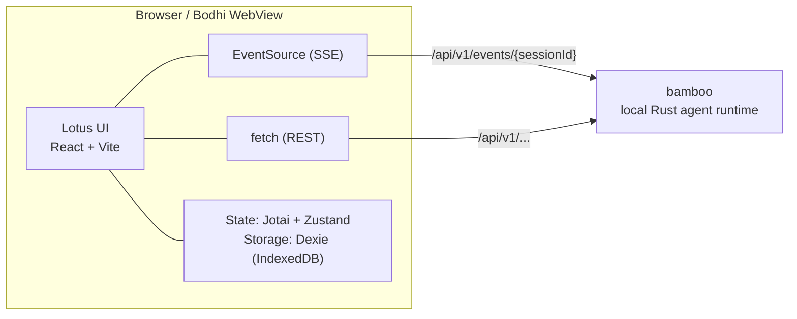

# Lotus — The Living Interface

> 📖 中文版请看 **[README.zh-CN.md](./README.zh-CN.md)**

> React + Vite UI layer for Zenith · `@bigduu/lotus`

---

## What this is

Lotus is the pane of glass between you and an AI agent. You type, it answers — but the real magic is that **you can watch it think and work**: which file it's reading, which tool it's calling, the to-do list it drew up, the diagram it sketched, all streaming onto the screen live. It turns an otherwise black-box AI into a transparent, observable teammate you can interrupt at any time.

---

## Key capabilities at a glance

| Capability | What it gives you |
| --- | --- |
| **Live event stream** | Token-by-token answers, reasoning and tool calls over SSE, batched per animation frame (`requestAnimationFrame`) |
| **Command palette** | `Cmd/Ctrl + K` — one keystroke to jump to sessions, settings, themes, new tasks |
| **Settings center** | Providers, model limits, MCP, hooks, schedules, env vars, keyword masking, metrics dashboard |
| **Live to-do list** | The agent's plan, updating its progress as it runs |
| **Question dialog** | Pops up when the agent needs clarification; options + free text |
| **Mermaid rendering** | Diagrams render inline with zoom/pan and one-click AI fix |
| **Skill management** | Browse and toggle agent skills |
| **Multi-pane** | Split the layout to view multiple sessions side by side |
| **Bilingual + theming** | zh-CN / en-US, light/dark, VDI safe mode |

---

## Architecture

Lotus is a **pure frontend** (React 18 + Vite 6 + TypeScript). It carries no business backend of its own — all agent execution lives in **bamboo** (the local Rust runtime). Lotus talks to bamboo over **HTTP + SSE**: plain requests via REST (`/api/v1/...`), live output via Server-Sent Events (`/api/v1/events/{sessionId}`, auto-reconnecting through the browser's native `EventSource`). The same build artifact (`dist/`) is loaded by the **bodhi** desktop shell and is equally runnable in a plain browser for development.



**Stack highlights (verified in `package.json`):**

- **UI / components**: Ant Design 5 (`antd`, `@ant-design/icons`)
- **State**: Jotai (`jotai`, `jotai-family`) for fine-grained streaming atoms + Zustand (`zustand`) for app/UI stores
- **Local storage**: Dexie (IndexedDB) — `src/services/storage/StorageDb.ts`
- **Markdown**: `react-markdown` + `remark-gfm` / `remark-breaks` + `rehype-sanitize` + `react-syntax-highlighter`
- **Diagrams**: `mermaid` (with `react-zoom-pan-pinch` viewer)
- **Metrics charts**: `recharts`
- **Export**: `jspdf` + `html2canvas`
- **i18n**: `i18next` + `react-i18next` (locales: `zh-CN`, `en-US`)
- **Virtualization**: `@tanstack/react-virtual`

**Source map (`src/`):**

```text
src/
├── app/                  # App bootstrap, MainLayout (sidebar + panes + settings)
├── pages/
│   ├── ChatPage/         # The chat experience (the flagship)
│   │   ├── streaming/    # Jotai atoms + RAF-batched streaming state
│   │   ├── hooks/        # useAgentEventSubscription, useChatManager, ...
│   │   ├── components/   # ~50 cards: ToolCallCard, TodoListDisplay,
│   │   │                 #   StreamingMessageCard, PlanMessageCard, ...
│   │   ├── conversation/ workspace/ inspector/ services/ utils/
│   ├── SettingsPage/     # SystemSettingsPage + tabs (providers, MCP, metrics...)
│   ├── SetupPage/  PasswordGatePage/
├── components/           # Skill, TodoList, QuestionDialog
├── shared/
│   ├── components/       # CommandPalette, MermaidChart, Markdown, ResizableSplit...
│   ├── store/            # Zustand stores (appStore, theme, settingsView, uiLayout...)
│   ├── i18n/             # zh-CN + en-US resources
│   ├── services/  hooks/  theme/  types/  utils/
├── services/             # HTTP/SSE clients: api/, chat/ (AgentService), config/,
│                         #   mcp/, metrics/, skill/, workspace/, storage/, ...
```

---

## Signature deep-dives

### Real-time SSE event stream

This is the soul of Lotus. `src/services/chat/AgentService.ts` declares an event vocabulary mirroring bamboo's — dozens of types from `token`, `reasoning_token`, `tool_token`, through `tool_start` / `tool_complete` / `tool_error`, `task_list_updated`, `token_budget_updated`, `context_compression_status`, `sub_agent_started`, `need_clarification`, `plan_mode_entered`, and more. The UI subscribes per session via the native `EventSource` (with `withCredentials`, auto-reconnect, and `Last-Event-ID` resume) on `/api/v1/events/{sessionId}`; an account-level broadcast runs over a single long-lived feed in `accountFeed.ts`.

To keep token-by-token output buttery without melting the browser, streaming state is held in **Jotai atoms** and **committed per animation frame** via `requestAnimationFrame` in `pages/ChatPage/streaming/useKeyedRafAtomState.ts` — you get a smooth typewriter effect instead of a re-render per token.

### The chat experience

`pages/ChatPage` isn't a text box — it's a whole vocabulary of cards. Every kind of agent activity has its own visualization: `StreamingMessageCard` (live answers), `ToolCallCard` / `ToolResultCard` / `ToolSessionCard` (the full lifecycle of a tool call), `PlanMessageCard` (plan mode), `QuestionMessageCard` (clarifications), `FileChangeViewer` (diffs of edited files), `TokenUsageDisplay` (context budget), `SessionSummaryCard` (compression summaries) — roughly 50 components in all. `MultiPaneChatView` + `ResizableSplit` let you split panes for side-by-side sessions; long lists stay smooth via `@tanstack/react-virtual`.

### Command palette

Hit `Cmd/Ctrl + K` (bound in `app/MainLayout.tsx` and `shared/components/CommandPalette/index.tsx`). It unifies two entry types: **actions** (open Provider settings, model limits, prompts, skills, MCP, workflows, hooks, schedules, sessions, metrics, keyword masking, toggle theme, new task, collapse sidebar…) and **session search** (fuzzy-jump by title, with pinned markers). Every label is i18n-driven, identical across zh/en.

### Settings center

`pages/SettingsPage/components/SystemSettingsPage` is a tabbed console, lazy-loaded to keep startup light. Verified tabs: **Providers** (`ProviderSettings`), **Model limits** (`ModelLimitsSettings`), **Prompts** (`SystemPromptManager`), **MCP** (server forms + management), **Workflows**, **Hooks**, **Schedules**, **Sessions**, **Env vars**, **Keyword masking**, **Notifications**, **Mermaid settings**, **Access password**, **Network**, and a `recharts`-powered **Metrics dashboard** (`UnifiedMetricsDashboard` with token charts, memory trends, model distribution, forward-endpoint distribution, and more).

Provider instances support **vendor presets**: the create/edit modal has a preset select (DeepSeek, 智谱 GLM, Z.ai, MiniMax, 通义千问 DashScope, Kimi — incl. the Anthropic-protocol variants of DeepSeek/GLM) that prefills the provider type and base URL from `src/shared/constants/providerPresets.ts`, so adding an OpenAI-compatible vendor is pick-and-paste-a-key. The preset itself is never persisted.

### Skills · questions · to-dos · Mermaid

- **Skill** (`src/components/Skill`): `SkillCard` / `SkillSelector` / `SkillManager` browse agent skills, toggle enable/disable, show license tags.
- **Question dialog** (`src/components/QuestionDialog`): pops up when the stream emits `need_clarification`, supports preset options and free text, and remembers per-session reasoning effort.
- **To-do list** (`src/components/TodoList` + `pages/ChatPage/components/TodoListDisplay`): live progress, status icons, dependencies and notes driven by `task_list_updated` and friends; collapsible and pinnable.
- **Mermaid** (`shared/components/MermaidChart`): lazy-loaded renderer, fits very wide diagrams to the viewport, zoom/pan via `react-zoom-pan-pinch`; on render failure exposes an `onFix` callback to hand the error back to the AI.

---

## Quick start

**Prerequisites:** Node.js LTS (20+) and npm. A running **bamboo** backend for live agent features (see below).

```bash
npm install
npm run dev          # Vite dev server → http://localhost:1420
```

**Run against bamboo** — in a second terminal, from the repo root:

```bash
cargo run --manifest-path bamboo/Cargo.toml --bin bamboo -- \
  serve --port 9562 --bind 127.0.0.1 --data-dir /tmp/bamboo-data
```

Lotus defaults to the backend at `http://127.0.0.1:9562/v1` (overridable via `VITE_BACKEND_BASE_URL`; see `src/shared/utils/backendBaseUrl.ts`).

### Verified scripts (`package.json`)

```bash
npm run dev               # Vite dev server (port 1420)
npm run build             # tsc + vite build → dist/
npm run preview           # preview the production build
npm run type-check        # tsc --noEmit
npm run lint              # eslint src   (lint:fix to autofix)
npm run format            # prettier --write   (format:check to verify)

npm run test              # vitest (watch)        test:ui / test:coverage
npm run test:run          # vitest run (one-shot)
npm run test:e2e          # Playwright (delegates to ./e2e)
npm run test:e2e:browser  # Playwright against http://localhost:1420
npm run test:e2e:with-server  # boots a throwaway bamboo, then runs Playwright

npm run pack:dry-run      # inspect the npm package contents
```

### Packaging & branding (verified)

```bash
npm run build:bamboo-package   # build, then stage dist into bamboo as a prebuilt frontend
npm run build:public           # rebrand (public) + build
npm run build:internal         # rebrand (internal) + build
npm run rebrand:check          # verify branding state
```

Published as **`@bigduu/lotus`** (`publishConfig.access: public`); `prepack` runs `npm run build` automatically.

---

## The rest of the stack

Lotus is the UI layer within the Zenith monorepo. Sibling modules:

- [`../bamboo`](../bamboo) — local-first Rust agent runtime (the execution engine Lotus talks to over HTTP + SSE)
- [`../bodhi`](../bodhi) — desktop AI product surface (Tauri shell that loads Lotus's `dist/`)
- [`../bodhi-server`](../bodhi-server) — Go backend (auth / persistence / billing + quota / LLM proxy)
- [`../pavilion`](../pavilion) — official website & docs
- [`..`](..) — Zenith root (monorepo entry, submodule pointers, release train)

**In-module docs:**

- Frontend docs root: [`docs/README.md`](./docs/README.md)
- Frontend architecture: [`docs/architecture/FRONTEND_ARCHITECTURE.md`](./docs/architecture/FRONTEND_ARCHITECTURE.md)
- Design spec: [`docs/DESIGN_SPEC.md`](./docs/DESIGN_SPEC.md)
- Feature docs (Command Selector / Question Dialog / Mermaid): [`docs/features/`](./docs/features/)
- Development guides: [`docs/development/`](./docs/development/)
