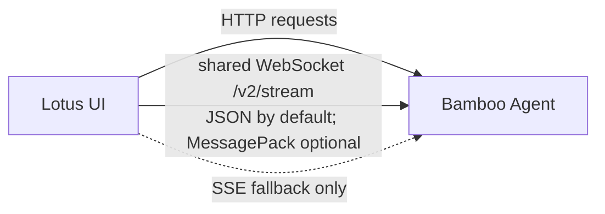

# Lotus — The Living Interface

> 中文版见 [README.zh-CN.md](./README.zh-CN.md).

Lotus is the React + Vite user interface for [Bamboo Agent](https://github.com/bigduu/Bamboo-agent). It presents conversations, streaming output, tool activity, plans, clarifications, and settings; agent execution remains owned by Bamboo.

## Runtime boundary

Lotus is a browser frontend, not a second agent runtime or business backend. Its current connection contract is:

| Path          | Current behavior                                                                                                                                              |
| ------------- | ------------------------------------------------------------------------------------------------------------------------------------------------------------- |
| Requests      | HTTP requests use the configured Bamboo backend base URL. The local default is `http://127.0.0.1:9562/v1`.                                                    |
| Live events   | One module-level WebSocket at `/v2/stream` is the default transport. The same connection carries the account feed and all per-session subscriptions.          |
| Wire encoding | JSON text frames are the default. MessagePack is optional and is used only when the `bamboo.v2.msgpack` WebSocket subprotocol is offered and negotiated.      |
| Fallback      | The legacy account and session SSE endpoints are fallback paths when the v2 transport is explicitly disabled or its initial connection cannot be established. |

The transport behavior is implemented in [`v2Stream.ts`](./src/services/chat/v2Stream.ts), with fallback ownership in [`AgentService.ts`](./src/services/chat/AgentService.ts) and URL construction in [`backendBaseUrl.ts`](./src/shared/utils/backendBaseUrl.ts).



Lotus keeps presentation state in the browser and batches streaming updates for responsive rendering. The backend remains the authority for sessions, agent lifecycle, tools, and persisted runtime state.

## Product surface

Lotus provides the interactive surfaces needed to operate Bamboo without duplicating Bamboo's responsibilities:

- Conversation views for streamed answers, tool activity, plans, file changes, and clarification requests.
- Session navigation, multi-pane layouts, command search, and keyboard-driven actions.
- Markdown and Mermaid rendering, local themes, and English/Chinese UI resources.
- Settings for backend capabilities such as providers, models, MCP, skills, hooks, schedules, and metrics.

These are capability groups, not an exhaustive inventory. Source code and in-app capability discovery remain the authority as the product evolves.

## Repository guide

- `src/app/` — application bootstrap and top-level layout.
- `src/pages/` — chat, settings, setup, and other page-level experiences.
- `src/services/` — Bamboo API clients, live transport, and browser-side storage adapters.
- `src/shared/` — shared components, state, i18n, types, themes, and utilities.
- `docs/` — architecture, development, feature, and testing notes.

Start with the [frontend architecture](./docs/architecture/FRONTEND_ARCHITECTURE.md), [design specification](./docs/DESIGN_SPEC.md), or [documentation index](./docs/README.md) when changing Lotus itself.

## Quick start

You need Node.js, npm, and a running Bamboo backend for live agent features.

In a [Bamboo Agent](https://github.com/bigduu/Bamboo-agent) checkout:

```bash
cargo run --bin bamboo -- \
  serve --port 9562 --bind 127.0.0.1 --data-dir /tmp/bamboo-data
```

In this Lotus checkout, in a second terminal:

```bash
npm install
npm run dev
```

Vite serves Lotus at `http://localhost:1420`. Set `VITE_BACKEND_BASE_URL` when Bamboo is not available at the local default.

If you use the [Zenith](https://github.com/bigduu/Zenith) aggregate checkout, run the same commands from its sibling `bamboo/` and `lotus/` directories. Paths such as `bamboo/Cargo.toml` are relative to the Zenith root, not to a standalone Lotus checkout.

Common validation commands:

```bash
npm run type-check
npm run lint
npm run test:run
npm run build
```

The package name is `@bigduu/lotus`; the repository's `package.json` is the authority for the complete, current script list.

## Browser and Bodhi deployment

During browser development, Lotus is served directly by Vite. The [Bodhi](https://github.com/bigduu/Bodhi-AI) production path is different:

1. The Bodhi release build stages a Lotus frontend package into the Bamboo server binary used as its sidecar.
2. Tauri starts with a small bundled splash page while Bamboo starts and becomes healthy.
3. Bodhi then navigates its WebView to the loopback Bamboo server, which serves Lotus.

Therefore Bodhi production does **not** use Lotus `dist/` directly as Tauri's `frontendDist`. The release relationship is defined by Bodhi's [sidecar build script](https://github.com/bigduu/Bodhi-AI/blob/main/scripts/build-sidecar.cjs), [Tauri configuration](https://github.com/bigduu/Bodhi-AI/blob/main/src-tauri/tauri.conf.json), and [runtime startup](https://github.com/bigduu/Bodhi-AI/blob/main/src-tauri/src/lib.rs).

## Related repositories

- [Bamboo Agent](https://github.com/bigduu/Bamboo-agent) — the local Rust agent runtime and API used by Lotus.
- [Bodhi](https://github.com/bigduu/Bodhi-AI) — the desktop shell that manages Bamboo and displays Lotus.
- [Bodhi Server](https://github.com/bigduu/bodhi-server) — hosted services used by the product where applicable.
- [Pavilion](https://github.com/bigduu/Pavilion) — the public website and documentation surface.
- [Zenith](https://github.com/bigduu/Zenith) — the aggregate repository that pins the component repositories as submodules.
