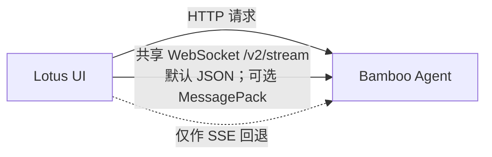

# Lotus · 莲花交互层

> English version: [README.md](./README.md).

Lotus 是 [Bamboo Agent](https://github.com/bigduu/Bamboo-agent) 的 React + Vite 用户界面。它负责呈现会话、流式输出、工具活动、计划、追问和设置；智能体执行仍由 Bamboo 负责。

## 运行边界

Lotus 是浏览器前端，不是第二套智能体运行时，也不是业务后端。当前连接约定如下：

| 路径     | 当前行为                                                                                                    |
| -------- | ----------------------------------------------------------------------------------------------------------- |
| 普通请求 | HTTP 请求使用已配置的 Bamboo 后端基址。本地默认值为 `http://127.0.0.1:9562/v1`。                            |
| 实时事件 | 默认使用 `/v2/stream` 上的单个模块级共享 WebSocket。同一条连接承载账号事件流和所有会话订阅。                |
| 线路编码 | 默认使用 JSON 文本帧。MessagePack 是可选项，仅在提出并成功协商 `bamboo.v2.msgpack` WebSocket 子协议后使用。 |
| 回退路径 | 只有在明确关闭 v2 传输，或首次连接无法建立时，才回退到旧的账号级与会话级 SSE 接口。                         |

传输行为实现在 [`v2Stream.ts`](./src/services/chat/v2Stream.ts) 中；[`AgentService.ts`](./src/services/chat/AgentService.ts) 负责回退边界，[`backendBaseUrl.ts`](./src/shared/utils/backendBaseUrl.ts) 负责地址构造。



Lotus 在浏览器内维护展示状态，并批量提交流式更新以保持渲染流畅。会话、智能体生命周期、工具和持久化运行状态仍以 Bamboo 为准。

## 产品界面

Lotus 提供操作 Bamboo 所需的交互界面，但不复制 Bamboo 的职责：

- 展示流式回答、工具活动、计划、文件改动和追问的会话界面。
- 会话导航、多窗格布局、命令搜索和键盘操作。
- Markdown 与 Mermaid 渲染、本地主题以及中英文界面资源。
- 面向 Provider、模型、MCP、技能、Hooks、计划任务和指标等后端能力的设置界面。

以上是能力分组，不是完整功能枚举。随着产品演进，应以源码和应用内的能力发现为准。

## 仓库导览

- `src/app/` — 应用启动与顶层布局。
- `src/pages/` — 对话、设置、初始化等页面级体验。
- `src/services/` — Bamboo API 客户端、实时传输和浏览器侧存储适配。
- `src/shared/` — 共享组件、状态、国际化、类型、主题和工具。
- `docs/` — 架构、开发、功能与测试文档。

修改 Lotus 本身时，可从[前端架构](./docs/architecture/FRONTEND_ARCHITECTURE.md)、[设计规范](./docs/DESIGN_SPEC.md)或[文档索引](./docs/README.md)开始。

## 快速开始

你需要 Node.js、npm，以及一个正在运行的 Bamboo 后端来使用实时智能体功能。

在 [Bamboo Agent](https://github.com/bigduu/Bamboo-agent) 检出目录中运行：

```bash
cargo run --bin bamboo -- \
  serve --port 9562 --bind 127.0.0.1 --data-dir /tmp/bamboo-data
```

在第二个终端进入当前 Lotus 检出目录：

```bash
npm install
npm run dev
```

Vite 会在 `http://localhost:1420` 提供 Lotus。若 Bamboo 不在本地默认地址，请设置 `VITE_BACKEND_BASE_URL`。

如果使用 [Zenith](https://github.com/bigduu/Zenith) 聚合检出，请分别在其中互为同级目录的 `bamboo/` 与 `lotus/` 中运行相同命令。`bamboo/Cargo.toml` 这类路径相对于 Zenith 根目录，而不是独立 Lotus 检出目录。

常用验证命令：

```bash
npm run type-check
npm run lint
npm run test:run
npm run build
```

包名是 `@bigduu/lotus`；完整且最新的脚本清单以仓库中的 `package.json` 为准。

## 浏览器与 Bodhi 发布关系

浏览器开发时，Lotus 由 Vite 直接提供。[Bodhi](https://github.com/bigduu/Bodhi-AI) 的生产路径不同：

1. Bodhi 发布构建会把 Lotus 前端包暂存并嵌入作为 sidecar 使用的 Bamboo server 二进制。
2. Tauri 启动时先显示一个很小的内置启动页，等待 Bamboo 启动并健康就绪。
3. 随后 Bodhi 将 WebView 导航到本机回环地址上的 Bamboo server，由该 server 提供 Lotus。

因此，Bodhi 生产版**不会**把 Lotus `dist/` 直接用作 Tauri 的 `frontendDist`。发布关系由 Bodhi 的 [sidecar 构建脚本](https://github.com/bigduu/Bodhi-AI/blob/main/scripts/build-sidecar.cjs)、[Tauri 配置](https://github.com/bigduu/Bodhi-AI/blob/main/src-tauri/tauri.conf.json)和[运行时启动代码](https://github.com/bigduu/Bodhi-AI/blob/main/src-tauri/src/lib.rs)共同定义。

## 相关仓库

- [Bamboo Agent](https://github.com/bigduu/Bamboo-agent) — Lotus 使用的本地 Rust 智能体运行时与 API。
- [Bodhi](https://github.com/bigduu/Bodhi-AI) — 管理 Bamboo 并展示 Lotus 的桌面外壳。
- [Bodhi Server](https://github.com/bigduu/bodhi-server) — 产品在适用场景使用的托管服务。
- [Pavilion](https://github.com/bigduu/Pavilion) — 公共网站与文档界面。
- [Zenith](https://github.com/bigduu/Zenith) — 以 Git submodule 固定各组件仓库版本的聚合仓库。
