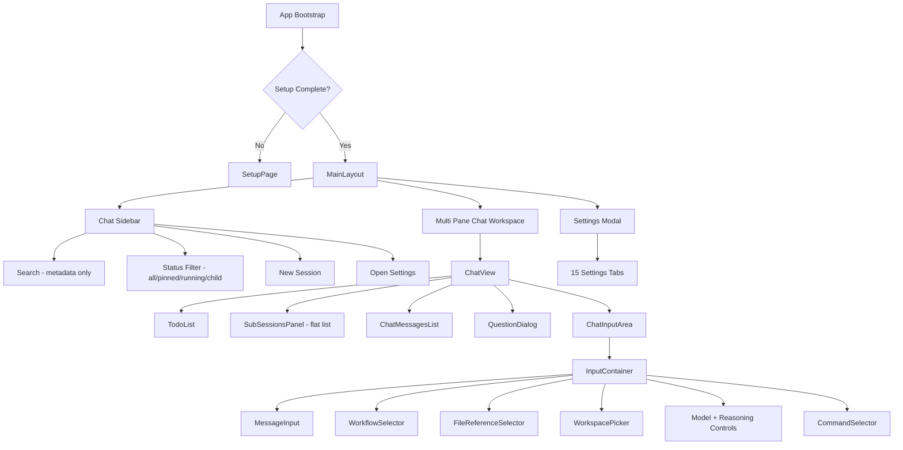
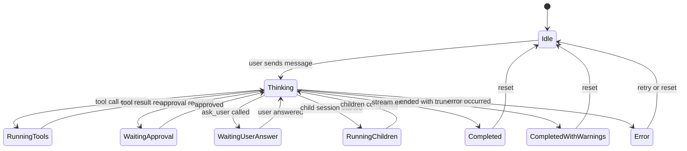
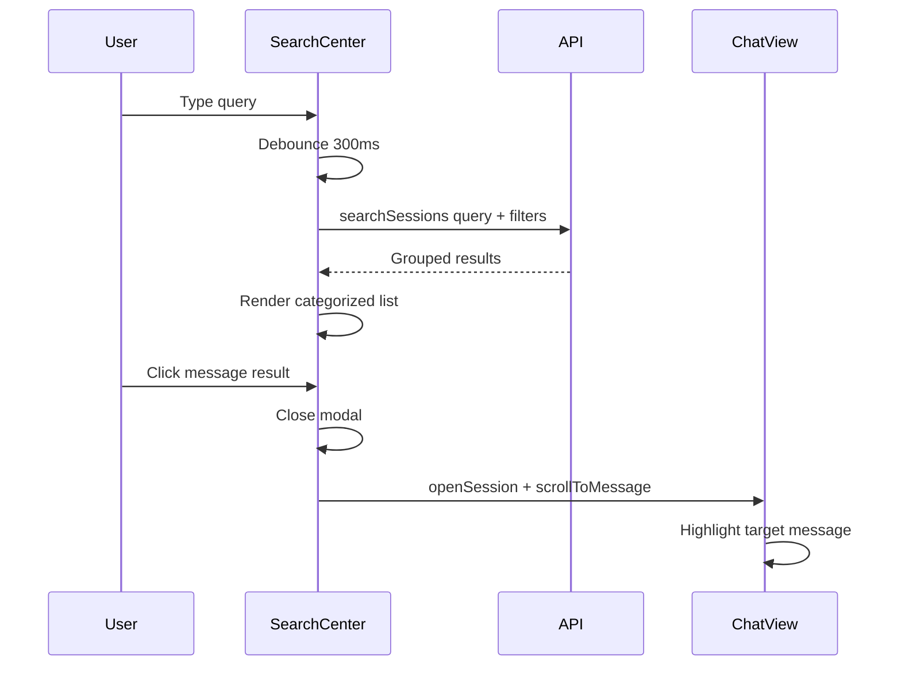
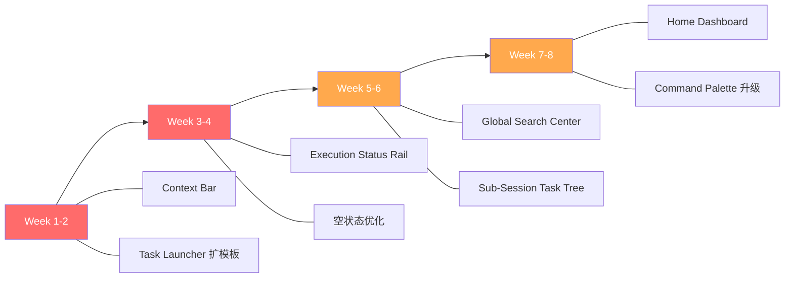

# Lotus 设计落地方案 — 新信息架构 + 关键页面规格

> **目标**：把 Lotus 从"聊天型 AI UI"升级为"开发者 Agent 工作台"  
> **原则**：不重写，渐进改造；每个模块可独立交付

---

## 一、信息架构演进

### 1.1 当前信息架构（As-Is）



**核心问题**：
1. 没有 Home / 总览层
2. 搜索只在 sidebar，只搜元数据
3. 上下文信息散落在 InputContainer 内部
4. 执行状态分散在多个组件
5. 子会话是扁平列表，无层级
6. Schedule / Workflow 只能从 Settings 进入
7. Command Palette 能力有限

---

### 1.2 新信息架构（To-Be）

```mermaid
graph TD
    A[App Bootstrap] --> B{Setup Complete?}
    B -- No --> C[SetupPage]
    B -- Yes --> D[MainLayout v2]

    D --> CP[Command Palette - Global Control]
    D --> E[Enhanced Sidebar]
    D --> HOME[Home Dashboard - Optional]
    D --> F[Multi Pane Chat Workspace v2]
    D --> G[Settings Modal]
    D --> SC[Search Center - Global Modal]

    CP --> CP1[Search Everything]
    CP --> CP2[Quick Actions]
    CP --> CP3[Navigate Settings/Sessions/Workflows]

    E --> E1[Search - triggers Search Center]
    E --> E2[Status Filter + Smart Groups]
    E --> E3[New Session - opens Task Launcher]
    E --> E4[Open Settings]
    E --> E5[Session Tree with Children]

    HOME --> H1[Continue Where You Left Off]
    HOME --> H2[Running Sessions]
    HOME --> H3[Scheduled Tasks]
    HOME --> H4[Recent Workspaces]
    HOME --> H5[Quick Task Templates]

    F --> CTX[Context Bar - persistent]
    F --> ESR[Execution Status Rail - persistent]
    F --> F1[ChatView v2]

    CTX --> CTX1[Workspace Badge]
    CTX --> CTX2[Referenced Files Count]
    CTX --> CTX3[Model + Reasoning]
    CTX --> CTX4[System Prompt ID]
    CTX --> CTX5[Context Mode Indicator]

    ESR --> ESR1[Status FSM Label]
    ESR --> ESR2[Current Tool Name]
    ESR --> ESR3[Child Session Count]
    ESR --> ESR4[Token Pressure]
    ESR --> ESR5[Truncation Warning]

    F1 --> F1a[TodoList]
    F1 --> F1b[Sub-Session Task Tree]
    F1 --> F1c[ChatMessagesList v2]
    F1 --> F1d[QuestionDialog]
    F1 --> F1e[Enhanced Input Area]

    F1e --> TL[Task Launcher - expanded]
    F1e --> IC[InputContainer v2]
    IC --> IC1[MessageInput]
    IC --> IC2[WorkflowSelector + Schedule Entry]
    IC --> IC3[FileReferenceSelector - enhanced]
    IC --> IC4[WorkspacePicker]
    IC --> IC5[Model + Reasoning Controls]
    IC --> IC6[CommandSelector]
    IC --> IC7[Save as Workflow/Template]

    SC --> SC1[Session Match]
    SC --> SC2[Message Content Match]
    SC --> SC3[Tool Result Match]
    SC --> SC4[File Path Match]
    SC --> SC5[Time + Type Filters]

    style CP fill:#e8daef,stroke:#8e44ad
    style HOME fill:#d5f5e3,stroke:#27ae60
    style CTX fill:#fdebd0,stroke:#e67e22
    style ESR fill:#fadbd8,stroke:#e74c3c
    style SC fill:#d6eaf8,stroke:#2980b9
    style TL fill:#fcf3cf,stroke:#f39c12
```



---

### 1.3 关键变化总结

| 区域 | As-Is | To-Be | 变化类型 |
|---|---|---|---|
| 首页 | 无，直接进 sidebar + 当前 session | 可选 Home Dashboard | 新增 |
| 搜索 | Sidebar 内，元数据匹配 | 全局 Search Center，内容级搜索 | 升级 |
| 新建会话 | 3 模板 EmptyTaskLauncher | 14+ 模板 Task Launcher，带预配置 | 升级 |
| 上下文 | 散落在 InputContainer 内部控件 | 持久可见 Context Bar | 新增 |
| 执行状态 | 分散在多组件 | 统一 Execution Status Rail | 新增 |
| 子会话 | 扁平列表，420px 限高 | 层级任务树 + 汇总能力 | 升级 |
| Schedule | 仅 Settings Tab | Settings + 会话内 + Launcher 多入口 | 升级 |
| Command Palette | Settings 跳转 + Session 搜索 | 全局控制台 | 升级 |
| Sidebar | 按日期分组 | 按日期分组 + 子会话树 + Smart Groups | 升级 |

---

## 二、关键页面/组件设计规格

---

### 2.1 Context Bar（上下文状态条）

#### 位置
`ChatView` 顶部，消息列表之上，持久可见。

#### 布局规格

```
┌──────────────────────────────────────────────────────────────────┐
│ 📂 ~/Projects/lotus  ·  📎 3 files  ·  🤖 claude-sonnet-4  ·  ⚡ high  ·  📝 Code Review │
│ [Full Workspace ▾]                                               [Edit Context]  │
└──────────────────────────────────────────────────────────────────┘
```

#### 组件结构

```typescript
// 新增: src/pages/ChatPage/components/ContextBar/index.tsx

type ContextBarProps = {
  sessionId: string;
};

// 展示内容
type ContextBarState = {
  workspace: {
    path: string | null;       // 当前 workspace
    isValid: boolean;          // 是否可用
  };
  fileReferences: {
    count: number;             // 引用文件数
    files: string[];           // 文件列表（hover 展示）
  };
  model: {
    name: string;              // 模型名
    provider: string;          // provider
  };
  reasoningEffort: ReasoningEffort | null;
  systemPrompt: {
    id: string;
    name: string;              // prompt 名称
  };
  contextMode: 'full_workspace' | 'referenced_only' | 'no_context';
};
```

#### 交互行为
| 元素 | 点击行为 | Hover 行为 |
|---|---|---|
| Workspace badge | 打开 WorkspacePicker | 显示完整路径 |
| File count | 打开 FileReferenceSelector | 显示文件列表 |
| Model name | 打开模型选择 dropdown | 显示 provider + limits |
| Reasoning effort | 循环切换 low/medium/high/xhigh/max | 显示当前值含义 |
| Prompt name | 打开 SystemPromptSelector | 显示 prompt 预览 |
| Context mode | 切换模式 dropdown | 显示各模式说明 |

#### 响应式行为
- `xs` 断点：折叠为单行，只显示 workspace + model，其余进 "..." dropdown
- `md+` 断点：完整一行展示

#### 视觉规格
- 高度：36px（单行）
- 背景：`token.colorBgContainer`
- 下边框：`1px solid token.colorBorderSecondary`
- 文字：`token.colorTextSecondary`，12px
- Badge 间距：`token.marginSM`
- 各 badge 用 `<Tag>` 组件，尺寸 small

---

### 2.2 Execution Status Rail（执行状态条）

#### 位置
`ChatView` 内，`ChatInputArea` 上方，`QuestionDialog` 上方。

#### 状态机定义



#### 布局规格

```
Active State:
┌──────────────────────────────────────────────────────────────────┐
│ ● Running Tools · apply_patch on src/main.rs · 🔄 2 children   │
│ ████████░░ Token: 45K/100K · ⚠ Near truncation                  │
└──────────────────────────────────────────────────────────────────┘

Idle State:
┌──────────────────────────────────────────────────────────────────┐
│ ○ Ready · Last: 3 tools, 2m ago · 12K tokens used              │
└──────────────────────────────────────────────────────────────────┘

Waiting State:
┌──────────────────────────────────────────────────────────────────┐
│ ◉ Waiting for your answer · Question: "Which file to update?"  │
│ [Answer ↑]                                                       │
└──────────────────────────────────────────────────────────────────┘
```

#### 组件结构

```typescript
// 新增: src/pages/ChatPage/components/ExecutionStatusRail/index.tsx

type ExecutionState =
  | 'idle'
  | 'thinking'
  | 'running_tools'
  | 'waiting_approval'
  | 'waiting_user_answer'
  | 'running_children'
  | 'completed'
  | 'completed_with_warnings'
  | 'error';

type ExecutionStatusRailProps = {
  sessionId: string;
};

// Store selector (新增)
const selectExecutionStatus = (sessionId: string) => (state: AppState): ExecutionStatusInfo => {
  const isProcessing = state.processingChats.has(sessionId);
  const tokenUsage = state.tokenUsages[sessionId];
  const truncation = state.truncationOccurred[sessionId];
  const taskList = state.taskLists[sessionId];
  const subSessions = state.subSessionsByParent[sessionId];
  const hasQuestion = /* derive from QuestionDialog state */;

  // Derive FSM state from these signals
  return {
    state: deriveExecutionState(isProcessing, hasQuestion, subSessions, truncation),
    lastToolName: /* from streaming state */,
    childSessionCount: Object.keys(subSessions || {}).length,
    runningChildCount: /* count running children */,
    tokenUsed: tokenUsage?.totalTokens || 0,
    tokenLimit: tokenUsage?.maxTokens || 0,
    tokenPressure: /* calculate pressure percentage */,
    truncationWarning: Boolean(truncation),
    lastActivityTime: /* timestamp */,
  };
};
```

#### 视觉规格

| 状态 | 指示器 | 颜色 | 动画 |
|---|---|---|---|
| Idle | `○` | `token.colorTextQuaternary` | 无 |
| Thinking | `●` | `token.colorPrimary` | pulse |
| Running Tools | `●` | `token.colorPrimary` | spinning |
| Waiting Approval | `◉` | `token.colorWarning` | pulse slow |
| Waiting User Answer | `◉` | `token.colorWarning` | pulse slow |
| Running Children | `●` | `token.colorInfo` | spinning |
| Completed | `✓` | `token.colorSuccess` | fade in |
| Completed with Warnings | `⚠` | `token.colorWarning` | fade in |
| Error | `✗` | `token.colorError` | shake |

- 高度：Idle 32px，Active 48-56px（两行）
- 背景：`token.colorBgLayout`
- Token 进度条：高度 3px，`token.colorPrimary` → `token.colorWarning` → `token.colorError`

---

### 2.3 Enhanced Task Launcher

#### 位置
替代当前 `EmptyTaskLauncher`，在 pane 没有 session 时显示。

#### 布局规格

```
┌──────────────────────────────────────────────────────────────────────┐
│                                                                      │
│                      Start with a task                               │
│         Create a focused session with the right context              │
│                                                                      │
│  [🔍 Search templates...]                                           │
│                                                                      │
│  ── Development ──────────────────────────────────────────────────    │
│  ┌─────────────────┐ ┌─────────────────┐ ┌─────────────────┐       │
│  │ + Blank Session  │ │ 🔍 Code Review  │ │ 🛠 Implement    │       │
│  │ Start from       │ │ Review code     │ │ Feature         │       │
│  │ scratch          │ │ changes with    │ │ Build a feature │       │
│  │                  │ │ focus on risks  │ │ step by step    │       │
│  │                  │ │ ──────────────  │ │ ──────────────  │       │
│  │                  │ │ 📂 workspace    │ │ 📂 workspace    │       │
│  │                  │ │ 🤖 sonnet       │ │ 🤖 sonnet       │       │
│  └─────────────────┘ └─────────────────┘ └─────────────────┘       │
│                                                                      │
│  ── Debugging ────────────────────────────────────────────────────    │
│  ┌─────────────────┐ ┌─────────────────┐ ┌─────────────────┐       │
│  │ 🐛 Bug Invest.  │ │ ❓ Explain Error │ │ 📊 Token Usage  │       │
│  │ Diagnose and    │ │ Understand what │ │ Investigate     │       │
│  │ trace bugs      │ │ went wrong      │ │ context growth  │       │
│  └─────────────────┘ └─────────────────┘ └─────────────────┘       │
│                                                                      │
│  ── Analysis ─────────────────────────────────────────────────────    │
│  ┌─────────────────┐ ┌─────────────────┐ ┌─────────────────┐       │
│  │ 🏗 Read Repo     │ │ ⚖ Compare Files │ │ ♻ Refactor      │       │
│  │ Architecture    │ │ Diff and        │ │ Suggest         │       │
│  │ analysis        │ │ understand      │ │ improvements    │       │
│  └─────────────────┘ └─────────────────┘ └─────────────────┘       │
│                                                                      │
│  ── Documentation ────────────────────────────────────────────────    │
│  ┌─────────────────┐ ┌─────────────────┐ ┌─────────────────┐       │
│  │ 📝 Release Notes│ │ 📋 Summarize    │ │ 📖 Write Docs   │       │
│  │ Generate from   │ │ Work summary    │ │ Documentation   │       │
│  │ git history     │ │ for standup     │ │ from code       │       │
│  └─────────────────┘ └─────────────────┘ └─────────────────┘       │
│                                                                      │
│  ── Operations ───────────────────────────────────────────────────    │
│  ┌─────────────────┐ ┌─────────────────┐                            │
│  │ ⏰ Create       │ │ 🔎 Review       │                            │
│  │ Schedule        │ │ Sessions        │                            │
│  │ Recurring task  │ │ Inspect history │                            │
│  └─────────────────┘ └─────────────────┘                            │
│                                                                      │
│  [+ Create custom template]                                         │
│                                                                      │
└──────────────────────────────────────────────────────────────────────┘
```

#### 类型扩展

```typescript
// 升级后的 LauncherTemplate 类型
type TemplateCategory = 'development' | 'debugging' | 'analysis' | 'documentation' | 'operations';

type LauncherTemplate = {
  id: string;                          // 不再限制为固定 union
  icon: React.ReactNode;
  title: string;
  description: string;
  sessionTitle: string;
  prefill: string;
  baseSystemPrompt?: string;
  // ---- 新增字段 ----
  category: TemplateCategory;
  recommendWorkspace?: boolean;        // 是否推荐设置 workspace
  recommendFileRefs?: boolean;         // 是否推荐附加文件引用
  recommendedModel?: string;           // 推荐模型
  recommendedReasoningEffort?: ReasoningEffort;
  exampleFirstMessage?: string;        // 示例首句
  isCustom?: boolean;                  // 用户自定义模板
  createdFrom?: string;                // 从哪个 session 保存的
};
```

#### 模板卡片组件规格

```
┌─────────────────────────────────┐
│  [Icon]  Template Title      →  │   ← 第一行：图标 + 标题 + 箭头
│                                  │
│  Short description that wraps   │   ← 描述文字，最多 2 行
│  to two lines maximum           │
│  ─────────────────────────────  │   ← 分隔线
│  📂 workspace  🤖 sonnet  ⚡ h  │   ← 推荐预配置 badges
└─────────────────────────────────┘

宽度: 200-240px (responsive grid)
高度: auto, min 120px
间距: token.marginMD
圆角: token.borderRadiusLG
```

#### 搜索与过滤
- 顶部搜索框，fuzzy match 模板名和描述
- 分类标签过滤器（All / Development / Debugging / Analysis / Documentation / Operations）
- 自定义模板标记为 ⭐ 可排在前面

---

### 2.4 Global Search Center

#### 位置
全局 Modal / Drawer，通过以下方式触发：
- Sidebar 搜索框聚焦后展开
- Command Palette 中选择 "Search everywhere"
- 快捷键 `⌘+Shift+F`

#### 布局规格

```
┌──── Global Search ───────────────────────────────── [×] ─────────┐
│                                                                    │
│  [🔍 Search messages, sessions, tools, files...        ]          │
│                                                                    │
│  Filters: [All ▾] [Any time ▾] [Any workspace ▾] [Include tools] │
│                                                                    │
│  ── Sessions (3 matches) ─────────────────────────────────────     │
│  ┌────────────────────────────────────────────────────────────┐   │
│  │ 📌 Code Review - lotus auth module     3h ago  ~/lotus    │   │
│  │ 🏃 Bug investigation - API timeout     1d ago  ~/backend  │   │
│  │    Release notes v2.1                  3d ago  ~/lotus    │   │
│  └────────────────────────────────────────────────────────────┘   │
│                                                                    │
│  ── Messages (12 matches) ────────────────────────────────────     │
│  ┌────────────────────────────────────────────────────────────┐   │
│  │ 💬 "The authentication bug is in src/auth/token.rs..."     │   │
│  │    in: Code Review - lotus auth · Assistant · 3h ago       │   │
│  │    [Jump to message →]                                     │   │
│  ├────────────────────────────────────────────────────────────┤   │
│  │ 💬 "I found the root cause in the middleware..."           │   │
│  │    in: Bug investigation - API timeout · Assistant · 1d    │   │
│  │    [Jump to message →]                                     │   │
│  ├────────────────────────────────────────────────────────────┤   │
│  │ 🔧 apply_patch → src/auth/token.rs (+15, -3)              │   │
│  │    in: Code Review - lotus auth · Tool Result · 3h ago     │   │
│  │    [Jump to message →]                                     │   │
│  └────────────────────────────────────────────────────────────┘   │
│                                                                    │
│  ── Files Referenced (5 matches) ─────────────────────────────     │
│  ┌────────────────────────────────────────────────────────────┐   │
│  │ 📄 src/auth/token.rs                                       │   │
│  │    Referenced in 3 sessions · Last: 3h ago                 │   │
│  │ 📄 src/middleware/auth.rs                                   │   │
│  │    Referenced in 2 sessions · Last: 1d ago                 │   │
│  └────────────────────────────────────────────────────────────┘   │
│                                                                    │
│  [Load more results...]                                           │
│                                                                    │
└──────────────────────────────────────────────────────────────────┘
```

#### 组件结构

```typescript
// 新增: src/shared/components/SearchCenter/index.tsx

type SearchResultCategory = 'session' | 'message' | 'tool_result' | 'file_path';

type SearchResult = {
  id: string;
  category: SearchResultCategory;
  title: string;
  snippet: string;              // 匹配上下文，高亮关键词
  sessionId: string;
  sessionTitle: string;
  messageId?: string;           // 消息级结果
  timestamp: string;
  workspace?: string;
  relevanceScore: number;
};

type SearchFilters = {
  category: SearchResultCategory | 'all';
  timeRange: 'any' | 'today' | 'week' | 'month';
  workspace: string | 'any';
  includeToolResults: boolean;
  sessionType: 'all' | 'root' | 'child' | 'pinned' | 'running';
};

type SearchCenterProps = {
  open: boolean;
  onClose: () => void;
  initialQuery?: string;        // 从 sidebar 搜索继承
};
```

#### 搜索流程



#### 键盘交互
- `⌘+Shift+F`：打开
- `Escape`：关闭
- `↑↓`：在结果间导航
- `Enter`：打开选中结果
- `Tab`：切换结果分类
- 输入时自动 debounce 300ms

---

### 2.5 Sub-Session Task Tree

#### 位置
替代当前 `SubSessionsPanel`，同一位置（ChatView 内，TodoList 下方）。

#### 布局规格

```
┌──── Sub-Sessions (5) ──────────────── [Collapse] [Summarize All] ─┐
│                                                                     │
│  ┌─ 🟢 Analyze API Layer ─────────────────── 2m ago ──────────┐   │
│  │  Responsibility: Review REST endpoints for breaking changes  │   │
│  │  Status: completed · 8 messages · 1.2K tokens               │   │
│  │  [Open] [Retry] [Delete]                                    │   │
│  │                                                              │   │
│  │  ├─ 🟡 Check auth endpoints ──────────── 1m ago ───────┐   │   │
│  │  │  Status: running · 3 messages                        │   │   │
│  │  │  [Open] [Continue] [Delete]                          │   │   │
│  │  └─────────────────────────────────────────────────────┘   │   │
│  │                                                              │   │
│  │  ├─ 🟢 Check payment endpoints ────────── 2m ago ──────┐   │   │
│  │  │  Status: completed · 5 messages                      │   │   │
│  │  │  [Open] [Delete]                                     │   │   │
│  │  └─────────────────────────────────────────────────────┘   │   │
│  └──────────────────────────────────────────────────────────────┘   │
│                                                                     │
│  ┌─ 🟢 Review UI Components ───────────────── 3m ago ──────────┐   │
│  │  Responsibility: Check React components for accessibility    │   │
│  │  Status: completed · 12 messages · 2.1K tokens               │   │
│  │  [Open] [Retry] [Delete]                                    │   │
│  └──────────────────────────────────────────────────────────────┘   │
│                                                                     │
│  ┌─ ⏳ Inspect Test Coverage ───────────────── queued ──────────┐   │
│  │  Responsibility: Run and analyze test coverage               │   │
│  │  Status: pending                                             │   │
│  │  [Open] [Run Now] [Delete]                                   │   │
│  └──────────────────────────────────────────────────────────────┘   │
│                                                                     │
│  ─────────────────────────────────────────────────────────────      │
│  Summary: 3 completed · 1 running · 1 pending                      │
│  [📋 Summarize All to Parent] [📦 Export All Results]               │
│                                                                     │
└─────────────────────────────────────────────────────────────────────┘
```

#### 关键交互

##### "Summarize All to Parent" 按钮
最重要的新功能。点击后：
1. 收集所有 child session 的最终 assistant 消息
2. 构造一个 summary prompt 发送到 parent session
3. 在 parent session 中生成一条汇总消息

```typescript
// 汇总 prompt 构造逻辑
const buildSummaryPrompt = (children: ChildSessionSummary[]): string => {
  const childResults = children.map((child, i) =>
    `### Child ${i + 1}: ${child.title}\n` +
    `**Responsibility**: ${child.responsibility}\n` +
    `**Status**: ${child.status}\n` +
    `**Key Findings**:\n${child.lastAssistantMessage}\n`
  ).join('\n---\n');

  return `Please summarize the results from ${children.length} child sessions below. ` +
    `Provide a unified conclusion with key findings, action items, and any conflicts or gaps.\n\n` +
    childResults;
};
```

##### 树形缩进
- Level 0（root children）：无缩进
- Level 1（grandchildren）：24px 左缩进，带连接线 `├─` / `└─`
- 最多展示 2 级，更深层级折叠

##### 无高度限制
- 移除 `SUB_SESSIONS_LIST_MAX_HEIGHT_PX = 420` 限制
- 改为默认折叠 + 展开后无限高
- 保留 auto-collapse 阈值，但提高到 5

#### 状态指示器

| 状态 | 图标 | 颜色 |
|---|---|---|
| pending | ⏳ | `token.colorTextQuaternary` |
| running | 🟡 | `token.colorWarning` |
| completed | 🟢 | `token.colorSuccess` |
| error | 🔴 | `token.colorError` |
| cancelled | ⚪ | `token.colorTextDisabled` |

---

### 2.6 Home Dashboard

#### 位置
可选的首页视图，当没有当前 session 或用户选择"Home"时展示。  
替代当前"进入就是空 pane"的体验。

#### 布局规格

```
┌────────────────────────────────────────────────────────────────────┐
│                                                                    │
│  Good morning 👋                                                   │
│                                                                    │
│  ── Continue Working ──────────────────────────────────────────    │
│  ┌────────────────────┐ ┌────────────────────┐                    │
│  │ 🟡 Code Review     │ │ 📌 Bug Invest.     │                    │
│  │ ~/lotus · 3h ago   │ │ ~/backend · 1d ago │                    │
│  │ "Reviewing auth    │ │ "Found root cause  │                    │
│  │  module changes"   │ │  in middleware"     │                    │
│  │ [Continue →]       │ │ [Continue →]        │                    │
│  └────────────────────┘ └────────────────────┘                    │
│                                                                    │
│  ── Quick Start ───────────────────────────────────────────────    │
│  [+ Blank] [🔍 Review] [🐛 Debug] [📝 Docs] [⏰ Schedule]       │
│                                                                    │
│  ── Active ────────────────────────────────────────────────────    │
│  │ 🏃 3 running sessions                        [View all →] │    │
│  │ ❓ 1 session waiting for your answer          [Answer →]  │    │
│  │ ⏰ 2 scheduled tasks active                   [Manage →]  │    │
│  │ ⚠ 1 session with high token pressure          [Review →]  │    │
│                                                                    │
│  ── Recent Workspaces ─────────────────────────────────────────    │
│  📂 ~/Projects/lotus     Last: 3h ago · 12 sessions              │
│  📂 ~/Projects/backend   Last: 1d ago · 8 sessions               │
│  📂 ~/Projects/infra     Last: 3d ago · 3 sessions               │
│                                                                    │
│  ── Pinned Sessions ───────────────────────────────────────────    │
│  📌 Important design decisions    3d ago                          │
│  📌 Production incident log       1w ago                          │
│                                                                    │
└────────────────────────────────────────────────────────────────────┘
```

#### 实现策略
- 新增 `src/pages/HomePage/` 或作为 `ChatView` 的 `empty` 变体
- 数据全部来自现有 store：`chats`, `processingChats`, `tokenUsages`, `schedules`
- 推荐：作为 `MultiPaneChatView` 在 `leafSessionIds[leafId] === null` 时的展示

---

### 2.7 Enhanced Command Palette

#### 扩展的 Action 类型

```typescript
// 在现有 CommandPaletteAction 基础上扩展 kind
type CommandPaletteAction = {
  id: string;
  kind: 'action' | 'session' | 'settings' | 'template' | 'workflow' | 'workspace' | 'quick';
  title: string;
  subtitle?: string;
  keywords: string[];
  icon: React.ReactNode;
  badge?: string;
  onSelect: () => Promise<void> | void;
};
```

#### 新增 Action 分类

| 分类 | 示例 Actions |
|---|---|
| Quick Actions | New blank session, New code review, New bug investigation |
| Pane Actions | Split horizontal, Split vertical, Close pane, Clear pane |
| Navigation | Open home, Open session monitor, Open schedules |
| Search | Search everything, Search sessions, Search messages |
| Settings (现有) | Open provider settings, Open MCP settings, ... |
| Sessions (现有) | 搜索历史会话列表 |
| Workflows | Open workflow X, Create new workflow |
| Workspaces | Switch to ~/lotus, Recent workspace X |
| Export | Export current session as Markdown/PDF |
| Theme | Toggle dark/light mode |

#### 分组展示
- 搜索为空时：显示 "Recent Actions" + "Quick Start" 分组
- 搜索有输入时：按相关性排序，带分组标签

---

## 三、ChatView 整体布局升级

### 升级后的 ChatView 垂直布局

```
┌────────────────────────────────────────────────────────────┐
│                    Context Bar                              │  ← 新增：持久可见
├────────────────────────────────────────────────────────────┤
│                    TodoList                                  │  ← 现有
├────────────────────────────────────────────────────────────┤
│                 Sub-Session Task Tree                        │  ← 升级：从扁平列表到树
├────────────────────────────────────────────────────────────┤
│                  Selection Toolbar                           │  ← 现有
├────────────────────────────────────────────────────────────┤
│                                                              │
│                                                              │
│                  ChatMessagesList                             │  ← 现有（主体）
│                                                              │
│                                                              │
├────────────────────────────────────────────────────────────┤
│               Execution Status Rail                          │  ← 新增：统一状态
├────────────────────────────────────────────────────────────┤
│                  QuestionDialog                              │  ← 现有
├────────────────────────────────────────────────────────────┤
│                                                              │
│                   ChatInputArea                              │  ← 现有
│            (or TaskLauncher if no messages)                  │
│                                                              │
└────────────────────────────────────────────────────────────┘
```

### 对应代码改动位置

```typescript
// ChatView/index.tsx 布局区域修改
return (
  <Layout style={{ height: "100%", position: "relative" }}>
    <Flex vertical style={{ flex: 1, minHeight: 0, height: "100%" }}>

      {/* ===== 新增: Context Bar ===== */}
      {sessionId && <ContextBar sessionId={sessionId} />}

      {/* 现有: TaskList */}
      {agentSessionId && hasTaskList && (
        <TodoList sessionId={agentSessionId} initialCollapsed={true} />
      )}

      {/* 升级: Sub-Session Task Tree (替代 SubSessionsPanel) */}
      {sessionId && hasSubSessions && (
        <SubSessionTaskTree parentSessionId={sessionId} />
      )}

      {/* 现有: Selection Toolbar */}
      {shouldShowSelectionToolbar && (/* ... */)}

      {/* 现有: ChatMessagesList */}
      <ChatMessagesList /* ... */ />

      {/* ===== 新增: Execution Status Rail ===== */}
      {sessionId && <ExecutionStatusRail sessionId={sessionId} />}

      {/* 现有: QuestionDialog */}
      {agentSessionId && <QuestionDialog /* ... */ />}

      {/* 现有: ChatInputArea / TaskLauncher */}
      <ChatInputArea /* ... */ />
    </Flex>
  </Layout>
);
```

---

## 四、交付优先级与实施顺序

### 推荐实施顺序（渐进式）



### 每个组件的独立可交付性

| 组件 | 可独立交付 | 对现有代码影响 | 前端改动范围 |
|---|---|---|---|
| Context Bar | ✅ | 小（新增组件） | `ChatView` + 新组件 |
| Task Launcher | ✅ | 小（扩展现有） | `EmptyTaskLauncher` |
| Execution Status Rail | ✅ | 小（新增组件 + selector） | `ChatView` + 新组件 + store |
| Search Center | ⚠️ 需后端 API | 中（新增全局组件） | 新组件 + API layer |
| Sub-Session Task Tree | ✅ | 中（替代现有组件） | `SubSessionsPanel` → 新组件 |
| Home Dashboard | ✅ | 小（新增页面/变体） | 新组件 |
| Command Palette | ✅ | 小（扩展现有） | `CommandPalette` |

---

## 五、设计 Token / 视觉规范备忘

所有新组件应遵循现有 Lotus 设计系统：

| 属性 | 来源 | 备注 |
|---|---|---|
| 颜色 | `theme.useToken()` | 不硬编码颜色值 |
| 间距 | `token.marginXS/SM/MD/LG` | 统一使用 token |
| 圆角 | `token.borderRadius/LG` | |
| 阴影 | `token.boxShadow/Secondary` | |
| 字体 | `token.fontSize/SM/LG` | |
| 组件 | Ant Design 5 | 优先使用 antd 组件 |
| 响应式 | `Grid.useBreakpoint()` | 跟随现有断点策略 |
| 国际化 | `useTranslation()` | 所有文案走 i18n |
| CSS | CSS Modules 或 index.css + BEM | 跟随现有约定 |

---

*文档版本：v1.0*  
*基于代码审计时间：2025-03*  
*适用代码库：lotus (zenith/lotus)*
