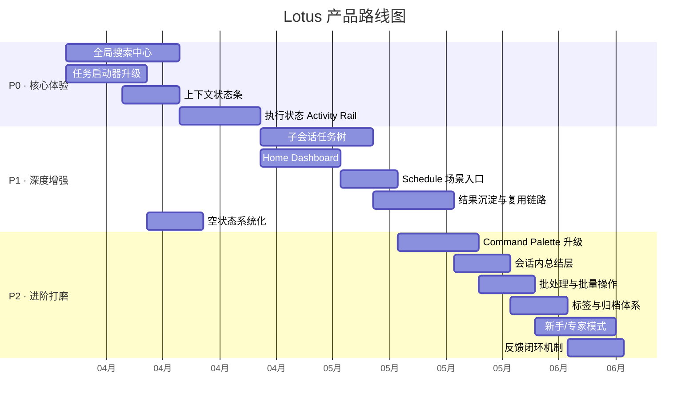
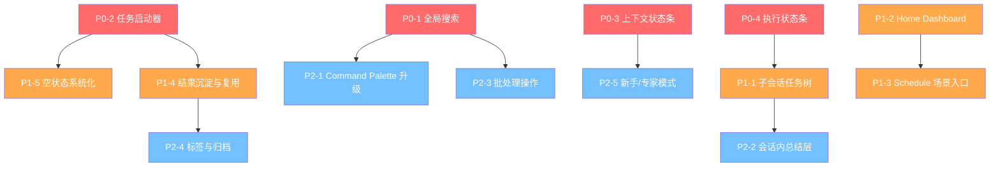

# Lotus 产品路线图 — 从"功能型 AI 工具"到"开发者 Agent 工作台"

> **核心判断**：Lotus 已经不缺底层能力，缺的是让用户自然发现、掌控和复用这些能力的体验层。  
> **三个关键维度**：发现性（Discoverability）→ 可控性（Controllability）→ 复用性（Reusability）

---

## 路线图总览



---

## P0：核心体验升级（优先级：极高）

> 目标：让 Lotus 从"能用"变成"好用"，解决最影响日常体验的 4 个痛点。  
> 预计周期：3-4 周

---

### P0-1：全局搜索中心（Global Search Center）

#### 问题
当前搜索（`useChatSidebarState.ts:21-36`）只匹配元数据字段：
```typescript
const haystack = [
  chat.title, chat.id, chat.kind || "root",
  chat.config.workspacePath || "",
  chat.updatedAt || "",
  chat.createdByScheduleId || "",
].join(" ").toLowerCase();
```
不支持消息正文、工具调用结果、文件路径等内容级搜索。随着会话积累，用户将面临严重的"找不到"问题。

#### 目标状态
- 搜索消息正文、工具调用结果、文件路径
- 按时间范围 / session 类型 / pinned / running 过滤
- 搜索结果分类展示（会话匹配 / 消息匹配 / 工具结果匹配）
- 点击结果直接跳转到对应消息锚点
- 独立搜索弹层 / 页面，不只是 sidebar input

#### 改造入口
| 文件 | 改动 |
|---|---|
| `useChatSidebarState.ts` | `matchesSearchQuery` 扩展为 async 内容搜索 |
| 新增 `SearchCenter/` 组件 | 搜索弹层 UI、结果列表、过滤器 |
| `ChatView/index.tsx` | 添加消息锚点标记，支持跳转 |
| 后端 API | 需要 session_inspector 的 search 能力暴露给前端 |

#### 工作量估算
| 部分 | 估算 |
|---|---|
| 后端搜索 API | 3-5 天 |
| 搜索弹层 UI | 3-4 天 |
| 消息锚点跳转 | 1-2 天 |
| 过滤器 + 结果分类 | 2-3 天 |
| **总计** | **~2 周** |

#### 依赖
- 后端需提供消息内容级搜索 API
- `session_inspector` 的 `search` action 可作为参考

#### 用户价值
- **长期使用效率**：会话越多，价值越大
- **知识资产化**：把过去的对话变成可检索的知识库
- **从一次性对话 → 长期工作台的关键一步**

#### 成功指标
- 搜索命中率 >80%（能找到记忆中的内容）
- 搜索到点击跳转 < 3 步
- 支持 >1000 条会话的搜索性能 < 2s

---

### P0-2：任务启动器升级（Enhanced Task Launcher）

#### 问题
当前 `EmptyTaskLauncher` 只有 3 个模板（blank / codeReview / tokenUsage），对 Agent 产品来说空白输入框不是最友好的起点。

#### 目标状态
- 扩展为 10-15 个任务模板
- 每个模板带：预设 system prompt、推荐 workspace、推荐模型/reasoning effort、示例首句
- 支持用户自定义模板
- 支持从现有成功会话保存为模板
- 模板分类：开发、分析、运维、文档、调试

#### 推荐模板清单

| 模板 | 分类 | System Prompt 方向 | 预设 |
|---|---|---|---|
| Blank Session | 基础 | 通用助手 | 无 |
| Code Review | 开发 | 代码审查模式 | workspace |
| Bug Investigation | 调试 | 问题诊断模式 | workspace + error log |
| Implement Feature | 开发 | 功能实现模式 | workspace |
| Read Repo Architecture | 分析 | 架构分析模式 | workspace |
| Explain This Error | 调试 | 错误解释模式 | error text |
| Compare Two Files | 分析 | 差异对比模式 | file refs |
| Refactor Suggestion | 开发 | 重构建议模式 | workspace + file refs |
| Generate Release Notes | 文档 | release notes 生成 | workspace |
| Create Scheduled Task | 运维 | 调度任务创建 | schedule config |
| Session History Review | 分析 | 会话历史分析 | session ref |
| Token Usage Diagnosis | 调试 | 上下文诊断模式 | session ref |
| Summarize Work | 文档 | 工作汇总模式 | time range |
| Write Documentation | 文档 | 文档编写模式 | workspace + file refs |

#### 改造入口
| 文件 | 改动 |
|---|---|
| `EmptyTaskLauncher/index.tsx` | `LauncherTemplate` 类型扩展、模板数组扩充 |
| 新增 `templates/` 目录 | 模板定义文件，分离数据和 UI |
| `InputContainer/index.tsx` | 模板选中后自动设置 workspace/model/reasoning |
| 新增 `TemplateEditor` 组件 | 用户自定义模板编辑器 |

#### 工作量估算
| 部分 | 估算 |
|---|---|
| LauncherTemplate 类型扩展 + 模板数据 | 2-3 天 |
| UI 升级（分类、搜索、网格布局） | 2-3 天 |
| 模板 → session 预配置联动 | 2 天 |
| 自定义模板编辑器 | 3-4 天 |
| **总计** | **~1.5 周** |

#### 依赖
- 无硬依赖，可独立推进

#### 用户价值
- **降低首次上手门槛**：新用户不需要从空白开始
- **把专家经验产品化**：模板是最佳实践的载体
- **从聊天机器人 → 工作流工具的体验转变**

#### 成功指标
- 使用模板启动的会话比例 >40%
- 新用户首次发送消息时间缩短 >50%
- 模板命中用户意图率 >70%

---

### P0-3：上下文状态条（Context Bar）

#### 问题
用户在会话中不确定当前上下文范围：
- 绑定的是哪个 workspace？
- AI 是看整个 workspace 还是只看引用的文件？
- 当前使用什么 model / reasoning effort？
- 当前的 system prompt / workflow 是什么？

#### 目标状态
在输入区上方或消息区顶部增加一个持久可见的"上下文仪表板"：
- 当前 workspace badge（可点击切换）
- 当前引用文件数（可点击查看列表）
- 当前 model / reasoning effort
- 当前 system prompt / workflow 标识
- 上下文模式指示器（full workspace / referenced files only / no context）

#### 改造入口
| 文件 | 改动 |
|---|---|
| `InputContainer/index.tsx` | 顶部添加 ContextBar 组件 |
| 新增 `ContextBar/` 组件 | 上下文信息聚合展示 |
| `ChatView/index.tsx` | 或在 ChatView 顶部展示 |
| `FileReferenceSelector` | 增加 fuzzy match、最近引用、pin/star |

#### 工作量估算
| 部分 | 估算 |
|---|---|
| ContextBar 组件 | 2-3 天 |
| 上下文模式切换 | 2 天 |
| FileReference 增强（fuzzy/recent/pin） | 2-3 天 |
| **总计** | **~1 周** |

#### 依赖
- 无硬依赖

#### 用户价值
- **更强掌控感**：一眼知道 AI 的工作范围
- **减少不透明感**：理解"AI 怎么知道这些"
- **更适合真实工程工作流**

#### 成功指标
- 用户对"AI 上下文范围"的理解准确率 >90%
- Workspace 切换误操作率下降 >50%

---

### P0-4：执行状态条（Execution Status Rail / Activity Bar）

#### 问题
当前信息分散在多个组件中：
- `processingChats` → 是否在处理
- `tokenUsages` → token 用量
- `truncationOccurred` → 截断状态
- `TaskList` → 任务进度
- `QuestionDialog` → 等待用户回答
- `SubSessionsPanel` → 子会话状态

用户经常不确定：系统到底卡住了？还是在工作？还是在等我操作？

#### 目标状态
统一成有限状态机式的状态条，位于输入框上方或右上角：

```
状态机：Idle → Thinking → Running Tools → Waiting for Approval
         → Waiting for User Answer → Running Child Sessions
         → Completed with Warnings → Error
```

展示内容：
- 当前状态标签（带动画）
- 最近运行的 tool 名称
- 子会话运行数
- Token 压力指示器
- Truncation 警告
- 预估剩余时间（可选）

#### 改造入口
| 文件 | 改动 |
|---|---|
| `ChatView/index.tsx` | 添加 ExecutionStatusRail 组件 |
| 新增 `ExecutionStatusRail/` 组件 | 统一状态聚合与展示 |
| `store/` | 可能需要新增聚合 selector |

#### 工作量估算
| 部分 | 估算 |
|---|---|
| 状态聚合逻辑 | 2-3 天 |
| 状态条 UI 组件 | 2-3 天 |
| 动画与转场 | 1-2 天 |
| **总计** | **~1.5 周** |

#### 依赖
- 无硬依赖

#### 用户价值
- **降低焦虑**：始终知道系统在做什么
- **降低误操作**：知道什么时候该等待、什么时候该操作
- **提高信任感**：透明的执行过程

#### 成功指标
- 用户"系统是否在工作"的判断准确率 >95%
- 因误判状态导致的重复操作减少 >70%

---

## P1：深度增强（优先级：高）

> 目标：释放 Lotus 的高级能力，让子会话、调度、复用等功能从"专家功能"变成"日常功能"。  
> 预计周期：4-6 周

---

### P1-1：子会话任务树（Sub-Session Task Tree）

#### 问题
当前 `SubSessionsPanel` 是扁平列表，有 420px 高度限制和 auto-collapse 阈值=3。无法展示层级关系和依赖。

#### 目标状态
- 按父子层级可视化成树
- 显示每个 child 的目标/职责摘要
- 显示谁在等待谁
- 显示最近更新时间和结果状态
- **核心能力**：一键 "Summarize children back to parent"
- 支持子会话批量操作

#### 工作量估算：~2 周

---

### P1-2：Home Dashboard

#### 问题
用户进入后只有 sidebar + 当前 session，没有全局总览。

#### 目标状态
提供可选的 Home 视图：
- Continue where you left off
- Recent sessions / Running sessions / Pinned sessions
- Scheduled tasks
- Recent workspaces
- Favorite task templates
- Token pressure / failed sessions / waiting questions

#### 工作量估算：~1.5 周

---

### P1-3：Schedule 融入任务流

#### 问题
Schedule 功能完整但只在 Settings 页，发现性极差。

#### 目标状态
新增场景化入口：
- 会话中 "Turn this into a schedule"
- TaskLauncher 中 "Scheduled report / recurring analysis"
- 结果页 "Run every day / every week"

#### 工作量估算：~1 周

---

### P1-4：结果沉淀与复用链路

#### 问题
会话是一次性的，成功的工作流无法被复用。

#### 目标状态
- 保存为 workflow / prompt template / skill draft
- 保存输出为 artifact（summary / report / runbook）
- Session snippets：收藏单条消息/结果

#### 工作量估算：~1.5 周

---

### P1-5：空状态系统化

#### 问题
多处空状态缺乏"下一步建议"。

#### 目标状态
为以下场景设计空态+行动建议：
- 搜索无结果
- 没有 workspace / 没有模型
- 没有可用 prompt / workflow
- Schedule/Session Monitor 为空
- Backend 不可达
- Token 超压 / truncation
- File reference 无匹配

#### 工作量估算：~1 周

---

## P2：进阶打磨（优先级：中-中高）

> 目标：把 Lotus 从"好用"推向"专业级工具"的感觉。  
> 预计周期：4-6 周

---

### P2-1：Command Palette 升级为全局控制台
- 搜索所有 settings/workflows/skills/MCP tools/recent files
- 快捷动作：new review / split pane / export session / toggle theme
- **工作量**：~1.5 周

### P2-2：会话内总结层
- 当前会话摘要卡 / 关键结论卡 / decision log
- Files changed summary / pending questions summary
- **工作量**：~1 周

### P2-3：批处理与批量操作
- 批量 pin/unpin / archive/delete / export / summarize sessions
- **工作量**：~1 周

### P2-4：标签与归档体系
- Archive session / Tags / Saved views / Smart groups
- **工作量**：~1 周

### P2-5：新手/专家模式
- Simple mode（隐藏高级控制）/ Advanced mode（完整功能）
- **工作量**：~1.5 周

### P2-6：反馈闭环机制
- This was helpful / not helpful
- Retry with variation（shorter / deeper / more actionable）
- Save preferred answer style
- **工作量**：~1 周

---

## 发版建议

### 快速见效版 A：发现性增强版（2-3 周）
| 功能 | 来源 |
|---|---|
| 任务启动器扩展 | P0-2 |
| 上下文状态条 | P0-3 |
| 执行状态条 | P0-4 |
| 空状态优化（部分） | P1-5 |

**效果**：产品立刻感觉"更顺、更专业"。

### 快速见效版 B：重度用户增强版（3-4 周）
| 功能 | 来源 |
|---|---|
| 全局搜索中心 | P0-1 |
| 子会话汇总 | P1-1 |
| Schedule 场景入口 | P1-3 |
| Command Palette 增强 | P2-1 |

**效果**：显著提升重度用户留存。

### 完整版 V1.0（10-14 周）
P0 全部 + P1 全部 + P2 中选 2-3 项

---

## 依赖关系图



---

## 关键技术决策备忘

1. **全局搜索的实现路径**：优先使用后端 `session_inspector` 的 search 能力，前端做 UI 和过滤。不建议前端全量加载消息做本地搜索。
2. **模板系统的扩展性**：`LauncherTemplate` 类型加 `category`、`recommendedWorkspace`、`recommendedModel`、`recommendedReasoningEffort`、`exampleFirstMessage` 字段。模板数据从组件中分离到独立文件。
3. **状态条的数据来源**：聚合 `processingChats` + `tokenUsages` + `truncationOccurred` + `taskLists` + `subSessionsByParent` + `QuestionDialog` 的状态。建议在 store 中新增一个 `selectExecutionStatus` derived selector。
4. **子会话树的数据模型**：当前 `allChildrenByRoot` 已经按 root 分组，但缺少多级嵌套。需要在 ChatItem 中利用 `parentSessionId` + `rootSessionId` 构建树结构。

---

*文档版本：v1.0*  
*基于代码审计时间：2025-03*  
*适用代码库：lotus (zenith/lotus)*
