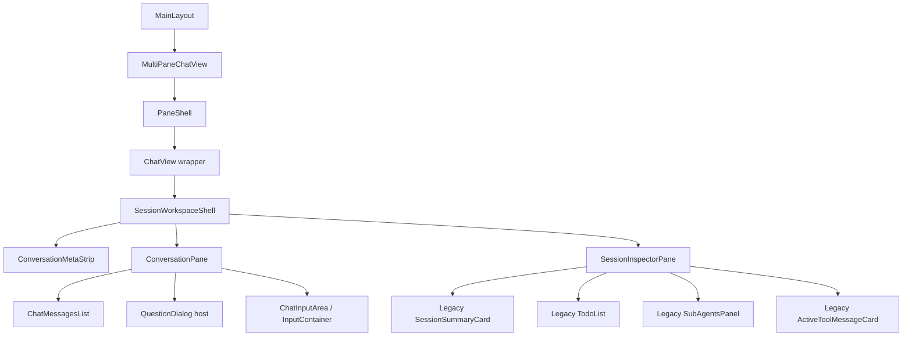

# Lotus ChatPage Frontend Refactor — Phase 1 Implementation Plan

> Related master plan: `docs/architecture/CHATPAGE_FRONTEND_REFACTOR_PLAN.md`

---

## 1. Phase 1 Goal

Phase 1 is **not** the full ChatPage rewrite.

Phase 1 exists to do one thing well:

> **Introduce the new Session Workspace shell and move heavy auxiliary panels out of the primary conversation stack, while keeping the message/composer/event pipeline behavior stable.**

In concrete terms, Phase 1 should turn the current structure from:

- stacked context/summary/tasks/sub-agents panels
- message timeline
- question card
- diff card above composer
- composer

into:

- compact conversation header / meta strip
- conversation timeline
- question card above composer
- composer
- separate inspector surface for summary / tasks / sub-agents / diffs

The big rule for Phase 1 is:

> **Rearrange structure first, preserve behavior second, rewrite internals later.**

---

## 2. Phase 1 Scope

## In scope

- Add the first version of `SessionWorkspaceShell`
- Add the first version of `ConversationPane`
- Add the first version of `SessionInspectorPane`
- Rehost existing legacy panels into an inspector surface
- Convert `ChatView` into a compatibility wrapper
- Do minimal prop plumbing through `MultiPaneChatView`
- Keep `QuestionDialog` session-local, above the composer
- Remove the diff card from above the composer and place it in inspector
- Preserve message rendering / selection / scroll / export behavior

## Explicitly out of scope

These belong to later phases, not Phase 1:

- rewriting `TodoList` internals
- rewriting `SubAgentsPanel` internals
- rewriting `SessionSummaryCard` internals
- rewriting `ActiveToolMessageCard` internals
- rewriting `InputContainer`
- rewriting `MessageCard`
- changing Zustand store schema
- changing SSE subscription ownership
- replacing `AgentService` / `useMessageStreaming`
- changing message history / execution data contracts

---

## 3. Phase 1 Architecture Target



---

## 4. Boundary Decisions for Phase 1

## 4.1 `MainLayout.tsx` boundary

**Decision**: leave `MainLayout.tsx` functionally unchanged in Phase 1.

### Why
- It already has the correct responsibilities:
  - global shell
  - sidebar shell
  - main workspace region
  - settings routing
  - deferred `useAgentEventSubscription`
- Changing it now increases blast radius without solving the ChatPage information architecture issue.

### Phase 1 impact
- **No required structural change** to `MainLayout`
- `MultiPaneChatView` remains the main content root
- Deferred SSE mount remains in `MainLayout`

---

## 4.2 `MultiPaneChatView` boundary

**Decision**: minimal changes only.

### Why
`MultiPaneChatView` is already the right owner for:
- pane creation / close / split
- pane focus
- pane-to-session assignment
- empty pane dashboard routing

### Required Phase 1 change
`PaneShell` must pass enough pane context to let the workspace shell choose inspector behavior.

### Important finding
`embedded={true}` is **not enough** to determine whether the chat is in a truly narrow multi-pane layout.

Why:
- `PaneShell` currently renders `<ChatView sessionId={sessionId} embedded={true} />` for all active panes
- that means even a single-pane workspace is `embedded=true`
- so inspector mode cannot be derived from `embedded` alone

### Phase 1 decision
Add one minimal prop from `PaneShell` into `ChatView`:

- `paneCount?: number`

Suggested usage:

```tsx
<ChatView sessionId={sessionId} embedded={true} paneCount={leafCount} />
```

This keeps `MultiPaneChatView` almost unchanged while giving the new workspace shell enough information to decide:
- persistent inspector rail
- drawer inspector
- collapsed inspector

### Phase 1 impact
- small `PaneShell` prop plumbing only
- no change to split/close/export button behavior
- no change to layout tree logic

---

## 4.3 `ChatView` boundary

**Decision**: `ChatView` becomes a compatibility wrapper in Phase 1.

### Why
`ChatView/index.tsx` is currently the most overloaded file in the feature.
Trying to rewrite all of it in one phase is high risk.

### Phase 1 target role
`ChatView` should stop being the place where layout is invented.
Instead, it should:
- keep the same public API for callers
- delegate to `SessionWorkspaceShell`

### Result
This preserves compatibility for:
- `MultiPaneChatView`
- tests importing `ChatView`
- any future direct imports

### Proposed Phase 1 `ChatViewProps`

```ts
type ChatViewProps = {
  sessionId?: string | null;
  embedded?: boolean;
  paneCount?: number;
};
```

### Phase 1 impact
- keep export name: `ChatView`
- internally return `SessionWorkspaceShell`
- old giant render tree moves out of `ChatView`

---

## 4.4 `QuestionDialog` host boundary

**Decision**: keep `QuestionDialog` session-local and keep it **above the composer**, inside the conversation domain.

### Why
`QuestionDialog` is not a generic global modal yet.
It is tied to:
- session ID
- pending question polling / event state
- respond flow for the active session
- sibling pane resolution events

Moving it to `MainLayout` or a global overlay in Phase 1 would introduce avoidable risk.

### Phase 1 host location
Keep it in the **conversation bottom stack**:
- below the timeline
- above the composer
- in the same relative place it has today

### Why this is the right compromise
- preserves session-local lifecycle
- preserves current polling / resolution behavior
- keeps it out of the timeline itself
- avoids a global interaction host refactor too early

### Explicit non-goal
Phase 1 does **not** convert `QuestionDialog` into an app-wide modal host.
That can happen later if desired.

---

## 4.5 Auxiliary panel host boundary

**Decision**: move these out of the conversation stack and into inspector tabs:

- `SessionSummaryCard`
- `TodoList`
- `SubAgentsPanel`
- `ActiveToolMessageCard`

### Phase 1 strategy
Do **not** rewrite them yet.
Use them as **legacy content inside new inspector slots**.

That means the first inspector is intentionally a hosting surface for old internals.
This is acceptable in Phase 1.

---

## 5. Target Phase 1 Layout Behavior

## 5.1 Desktop, single pane (`paneCount === 1`)

- persistent right-side inspector rail
- conversation remains the primary surface
- inspector width fixed in Phase 1, not resizable yet
- legacy panels mounted in tabs inside inspector

Suggested width:
- `340px` to `360px`

## 5.2 Desktop, multi-pane (`paneCount >= 2`)

- inspector should **not** permanently consume width in every pane
- use a right-side drawer / overlay inspector in Phase 1
- toggle it from conversation header/meta strip

### Why
A permanent inspector rail inside split panes will make multi-pane unreadable very quickly.

## 5.3 Mobile

- inspector is drawer-only
- never permanent side rail
- conversation remains full width

---

## 6. New Files to Add in Phase 1

## 6.1 Required new files

### Workspace shell
- `src/pages/ChatPage/workspace/SessionWorkspaceShell.tsx`
- `src/pages/ChatPage/workspace/useSessionWorkspaceViewModel.ts`
- `src/pages/ChatPage/workspace/workspace.css` *(or equivalent CSS file)*

### Conversation
- `src/pages/ChatPage/conversation/ConversationPane.tsx`
- `src/pages/ChatPage/conversation/ConversationMetaStrip.tsx`
- `src/pages/ChatPage/conversation/MessageSelectionToolbar.tsx`
- `src/pages/ChatPage/conversation/ScrollCapsule.tsx`

### Inspector
- `src/pages/ChatPage/inspector/SessionInspectorPane.tsx`
- `src/pages/ChatPage/inspector/InspectorTabs.tsx`

## 6.2 Optional helper files

These are optional in Phase 1, but helpful if the PR gets large:

- `src/pages/ChatPage/inspector/LegacyInspectorSections.tsx`
- `src/pages/ChatPage/workspace/getInspectorMode.ts`

---

## 7. Existing Files to Modify in Phase 1

## 7.1 Minimal prop plumbing
- `src/pages/ChatPage/components/MultiPaneChatView/index.tsx`

### Change
- pass `paneCount={leafCount}` into `ChatView`

---

## 7.2 Wrapper conversion
- `src/pages/ChatPage/components/ChatView/index.tsx`

### Change
- preserve `ChatView` export
- replace giant layout body with delegation to `SessionWorkspaceShell`
- keep current public props
- add optional `paneCount`

---

## 7.3 Reusable conversation pieces
- `src/pages/ChatPage/components/ChatView/ChatMessagesList.tsx`
- `src/pages/ChatPage/components/ChatView/useChatViewMessages.ts`
- `src/pages/ChatPage/components/ChatView/useChatViewScroll.ts`
- `src/pages/ChatPage/components/ChatView/events.ts`

### Change
- no behavioral rewrite in Phase 1
- either import them directly from the old path or re-export them through new files
- do not rename everything in the same PR unless necessary

---

## 7.4 Composer dock adjustment
- `src/pages/ChatPage/components/ChatView/ChatInputArea.tsx`

### Change
Remove responsibility for hosting the session diff card above the composer.

### Recommended Phase 1 approach
Add a prop:

```ts
showSessionDiffCard?: boolean;
```

Default behavior:
- `true` for backwards compatibility

Phase 1 workspace usage:
- pass `false`
- mount diff UI in inspector instead

### Why
This is the lowest-risk way to preserve the existing `ChatInputArea` while moving the diff surface out of the primary flow.

---

## 7.5 No required changes in Phase 1

These should stay behaviorally stable during Phase 1:

- `src/components/QuestionDialog/QuestionDialog.tsx`
- `src/components/TodoList/TodoList.tsx`
- `src/pages/ChatPage/components/ChatView/SubAgentsPanel.tsx`
- `src/pages/ChatPage/components/ChatView/ActiveToolMessageCard.tsx`
- `src/pages/ChatPage/components/SessionSummaryCard/index.tsx`
- `src/pages/ChatPage/components/InputContainer/index.tsx`
- `src/hooks/useAgentEventSubscription.ts`
- `src/pages/ChatPage/store/slices/chatSessionSlice.ts`
- `src/pages/ChatPage/store/slices/executionStateSlice.ts`
- `src/pages/ChatPage/store/slices/todoListSlice.ts`
- `src/services/chat/AgentService.ts`

These files may be *consumed differently*, but should not be structurally rewritten in Phase 1.

---

## 8. Recommended Phase 1 Component Responsibilities

## 8.1 `SessionWorkspaceShell.tsx`

### Responsibility
Top-level layout orchestration for a session workspace.

### Owns
- inspector open/close state
- inspector mode selection (`rail` vs `drawer`)
- `auxReady` gate ownership
- session-level derived data via `useSessionWorkspaceViewModel`
- composition of conversation + inspector

### Does not own
- low-level message rendering
- composer internals
- direct backend execution logic

### Suggested props

```ts
type SessionWorkspaceShellProps = {
  sessionId?: string | null;
  embedded?: boolean;
  paneCount?: number;
};
```

---

## 8.2 `useSessionWorkspaceViewModel.ts`

### Responsibility
Extract and preserve session-level loading + derived state currently inside `ChatView`.

### Candidate contents to extract from current `ChatView`

- resolved `sessionId`
- `currentChat`
- `currentMessages`
- history lazy-load effect
- monotonic history sync effect
- shared task list load effect
- `hasTaskList`
- `shouldShowTaskPanel`
- `hasSubAgents`
- `sessionDiffSummary`
- `isBusy` / `isThinking`
- token usage / truncation / compression derived values
- `planModeIndicator` raw data or render inputs
- `auxReady`

### Things **not** to extract yet
Keep these inside `ConversationPane` in Phase 1:
- selection mode state
- selected message IDs
- export handlers
- scroll behavior
- workflow draft state
- timeline renderable entries

That keeps the view-model focused on session shell state, not full timeline interaction state.

---

## 8.3 `ConversationPane.tsx`

### Responsibility
Own the visible conversation flow.

### Owns in Phase 1
- header/meta strip render
- renderable message creation via `useChatViewMessages`
- selection/export state
- message list render
- scroll capsule render
- question dialog host
- composer dock render

### Keeps from current behavior
- same message list implementation
- same selection toolbar behavior
- same scroll button behavior
- same `QuestionDialog` relative placement
- same `ChatInputArea` / `InputContainer` behavior

### Important rule
`ConversationPane` must not remount the session or own session loading effects that belong to the workspace shell.

---

## 8.4 `ConversationMetaStrip.tsx`

### Responsibility
Provide a compact header area above the timeline.

### Phase 1 implementation strategy
Do **not** over-engineer this yet.

Use it to host:
- existing `ContextBar` (or a thin wrapper around it)
- token/compression indicator
- plan mode indicator
- inspector toggle button

### Why
This gives us a compact header quickly without rewriting `ContextBar` logic in the same phase.

### Note
If combining `ContextBar` into a new compact layout is too risky for the first PR, fallback is acceptable:
- keep `ContextBar` visually at the top of the conversation pane
- still move the heavy panels into inspector

That fallback is allowed in Phase 1.

---

## 8.5 `SessionInspectorPane.tsx`

### Responsibility
Own the inspector surface and host legacy panels.

### Owns
- available tab derivation
- selected inspector tab state
- drawer/rail mode rendering
- lazy mount of legacy auxiliary components once `auxReady === true`

### Available tabs in Phase 1

Suggested tabs:
- `Overview`
- `Tasks`
- `Agents`
- `Diffs`

### Suggested visibility rules

- `Overview`
  - show when `isAdvancedMode && showMessagesView`
- `Tasks`
  - show when `shouldShowTaskPanel`
- `Agents`
  - show when `hasSubAgents`
- `Diffs`
  - show when `sessionDiffSummary !== null`

### Important note
Inspector should hide entirely if there are no available tabs.

---

## 8.6 `InspectorTabs.tsx`

### Responsibility
Small presentational wrapper around tab rendering.

### Why separate it
This keeps `SessionInspectorPane` focused on mode + availability, not tab markup details.

---

## 8.7 `MessageSelectionToolbar.tsx`

### Responsibility
Extract the selection/export toolbar UI out of `ChatView`.

### Why in Phase 1
This is one of the cleanest extractions from the current `ChatView` and immediately reduces shell clutter.

---

## 8.8 `ScrollCapsule.tsx`

### Responsibility
Extract the floating top/latest navigation capsule UI from `ChatView`.

### Why in Phase 1
Also a clean extraction with low logic risk.

---

## 9. Wrapper and Migration Strategy

## 9.1 Preserve public entry points first

Do not rename imports across the repo at the start of Phase 1.

### Preserve
- `ChatView`
- old `ChatMessagesList`
- old `useChatViewMessages`
- old `useChatViewScroll`
- old `ChatInputArea`

### Use strategy
- new shell imports existing components
- old `ChatView` delegates to new shell

This means Phase 1 is a **recomposition PR**, not a rename/move storm.

---

## 9.2 Move layout ownership before moving all files

The sequence should be:

1. create new shell files
2. recompose existing pieces under the new shell
3. convert old `ChatView` into wrapper
4. only later move/rename files physically

That minimizes breakage and reduces noisy diffs.

---

## 9.3 Keep legacy panels inside inspector as stopgaps

Do **not** rewrite these for Phase 1:
- `SessionSummaryCard`
- `TodoList`
- `SubAgentsPanel`
- `ActiveToolMessageCard`

Just mount them inside inspector tabs.

### Acceptable stopgap cost
- nested card chrome
- nested collapse affordances
- slightly redundant titles

These are acceptable temporary costs for Phase 1.
The structural win matters more.

---

## 10. Step-by-Step Implementation Sequence

## Step 1 — Add pane context plumbing

### Files
- `src/pages/ChatPage/components/MultiPaneChatView/index.tsx`
- `src/pages/ChatPage/components/ChatView/index.tsx`

### Change
- add `paneCount?: number` to `ChatViewProps`
- pass `leafCount` from `PaneShell` into `ChatView`

### Goal
Give the new workspace shell enough context to choose inspector mode.

### Risk
Low.

---

## Step 2 — Add `SessionWorkspaceShell` and session view-model

### New files
- `workspace/SessionWorkspaceShell.tsx`
- `workspace/useSessionWorkspaceViewModel.ts`

### Extract into view-model
From current `ChatView`:
- resolved session and chat state
- load history effect
- monotonic sync effect
- shared task list load effect
- diff summary derivation
- token / truncation / compression / plan mode data
- `auxReady`

### Goal
Get all session-scoped shell logic out of the current `ChatView`.

### Risk
Medium.

### Mitigation
Do not mix selection/export/scroll state into this hook yet.

---

## Step 3 — Add `ConversationPane`

### New files
- `conversation/ConversationPane.tsx`
- `conversation/ConversationMetaStrip.tsx`
- `conversation/MessageSelectionToolbar.tsx`
- `conversation/ScrollCapsule.tsx`

### Source material to move from current `ChatView`
- selection toolbar block
- `useChatViewMessages(...)`
- `ChatMessagesList` host
- scroll capsule block
- `QuestionDialog` host block
- `ChatInputArea` host block

### Goal
Establish the conversation as a dedicated pane.

### Phase 1 rule
Keep internal behavior as close to today as possible.

### Risk
Medium.

### Mitigation
Keep existing lower-level components intact; only recompose them.

---

## Step 4 — Add `SessionInspectorPane` and move legacy auxiliary panels there

### New files
- `inspector/SessionInspectorPane.tsx`
- `inspector/InspectorTabs.tsx`

### Legacy components to mount inside inspector
- `LazySessionSummaryCard`
- `LazyTodoList`
- `LazySubAgentsPanel`
- `ActiveToolMessageCard`

### Goal
Remove the heavy top-of-timeline panel stack.

### Behavior rules
- mount only when `auxReady`
- hide inspector completely when there are no tabs
- use rail for single-pane desktop
- use drawer for mobile and multi-pane

### Risk
Medium.

### Mitigation
Use old components unchanged as first-tab content.

---

## Step 5 — Remove diff card from above composer

### File
- `src/pages/ChatPage/components/ChatView/ChatInputArea.tsx`

### Change
Add optional prop to suppress diff card rendering.

### Goal
Make the composer dock clean again.

### Risk
Low.

---

## Step 6 — Convert `ChatView` into wrapper

### File
- `src/pages/ChatPage/components/ChatView/index.tsx`

### Change
After steps 2–5 exist:
- replace existing layout render tree with `<SessionWorkspaceShell ... />`
- preserve exports and prop shape

### Goal
Finish the Phase 1 shell migration without changing callers.

### Risk
Medium.

### Mitigation
Do this only after the new shell renders all existing required behavior.

---

## 11. Suggested PR Breakdown

## PR 1 — Workspace shell scaffolding

### Include
- `paneCount` prop plumbing
- `SessionWorkspaceShell`
- `useSessionWorkspaceViewModel`
- `ConversationPane`
- `MessageSelectionToolbar`
- `ScrollCapsule`
- `ChatView` wrapper conversion

### Exclude
- inspector panel migration
- diff removal from composer if it causes too much scope

### Goal
Get the new shell in place with minimal behavioral change.

---

## PR 2 — Inspector rehost

### Include
- `SessionInspectorPane`
- `InspectorTabs`
- rehost `SessionSummaryCard`, `TodoList`, `SubAgentsPanel`, `ActiveToolMessageCard`
- remove stacked top panels from old conversation flow
- disable diff card above composer

### Goal
Deliver the visible UX win: primary conversation surface is no longer vertically buried.

---

## PR 3 — Phase 1 polish and tests

### Include
- responsive inspector behavior cleanup
- meta strip refinement
- test updates
- doc updates / screenshots

### Goal
Make Phase 1 stable and mergeable.

---

## 12. Test Strategy for Phase 1

## 12.1 Automated tests to add / update

### A. Wrapper + shell tests
Add tests for:
- `ChatView` still renders via the same public entry
- `paneCount` is accepted and forwarded
- inspector hidden when no tabs available
- inspector rail vs drawer mode selection logic

### B. Conversation regression tests
Preserve or adapt existing tests for:
- scroll buttons / unread capsule behavior
- message selection toolbar toggling
- export toolbar flow
- question dialog placement and render

### C. Multi-pane regression tests
Add or update tests to confirm:
- `PaneShell` passes pane context
- split panes still render working session content
- export-selection event still targets the correct session

### D. Inspector content smoke tests
Add smoke-level tests for:
- Tasks tab mounts `TodoList`
- Agents tab mounts `SubAgentsPanel`
- Diffs tab mounts `ActiveToolMessageCard`
- Overview tab mounts `SessionSummaryCard` when applicable

---

## 12.2 Manual verification checklist

### Single pane
- open a session with summary/tasks/sub-agents/diffs
- verify they appear in inspector, not stacked above timeline
- verify composer stays visible and compact
- verify question card still appears above composer

### Multi-pane
- split into 2 panes
- verify each pane still renders a session
- verify inspector does not permanently consume excessive width
- verify per-pane interaction remains correct

### Task-heavy session
- verify task list still updates live
- verify child session task sharing still works

### Diff-heavy session
- verify session diff summary still reflects file changes
- verify diff detail is accessible from inspector

### Pending question flow
- verify selecting an option still responds and resumes correctly
- verify sibling pane resolution event still clears the dialog for the same session

---

## 13. Acceptance Criteria for Phase 1

Phase 1 is accepted when all of the following are true:

### Layout
- `SessionSummaryCard`, `TodoList`, `SubAgentsPanel`, and `ActiveToolMessageCard` are no longer stacked above the timeline.
- The conversation timeline is the dominant vertical surface again.
- Inspector exists and is accessible.

### Stability
- Message history still loads correctly.
- Monotonic history sync still works.
- Shared task list loading still works.
- Pending question flow still works.
- Multi-pane split/close/focus behavior still works.

### Architecture
- `ChatView` is no longer the place where the page layout is invented.
- New shell files exist and own the layout composition.
- No store / SSE ownership moved into UI components.

### Migration hygiene
- old callers still import `ChatView` without changes
- rollback remains possible by restoring the old `ChatView` body

---

## 14. Risk Register

## Risk 1 — `paneCount` is only a heuristic
Using pane count is better than `embedded`, but it still is not true container measurement.

### Mitigation
Accept `paneCount` as the first Phase 1 heuristic.
Replace it with actual pane width / resize observer in later phases if needed.

---

## Risk 2 — Legacy inspector content will have nested chrome
`TodoList`, `SessionSummaryCard`, `SubAgentsPanel`, `ActiveToolMessageCard` will still look like legacy cards inside new tabs.

### Mitigation
Explicitly accept this as Phase 1 debt.
Phase 4 rewrites these surfaces.

---

## Risk 3 — `QuestionDialog` remount behavior
Moving the host too far upward could affect its polling/session-local lifecycle.

### Mitigation
Keep it in conversation bottom stack in Phase 1.
Do not globalize it yet.

---

## Risk 4 — ChatView test churn
Tests referencing old DOM structure may fail when panels move.

### Mitigation
Preserve `ChatView` export and adapt tests gradually to shell-based structure.

---

## 15. Rollback Strategy

Phase 1 should be implemented so rollback is easy.

## Required rollback-friendly design choices
- keep `ChatView` export name
- avoid renaming dozens of files in the first PR
- introduce new files before deleting old structure
- keep old low-level components intact

## Rollback path
If Phase 1 proves unstable:
1. restore previous `ChatView/index.tsx` render tree
2. keep new workspace/inspector files unused
3. remove `paneCount` prop plumbing later if desired

Because `MainLayout`, store slices, SSE hook, and service layer remain stable, rollback cost stays low.

---

## 16. Recommended Immediate Next Action After This Plan

Once this plan is approved, the very next implementation task should be:

> **Create the Phase 1 shell files and convert `ChatView` into a thin wrapper without changing callers.**

That is the cleanest first cut and creates the new architecture skeleton without forcing a full rewrite of every legacy component.
