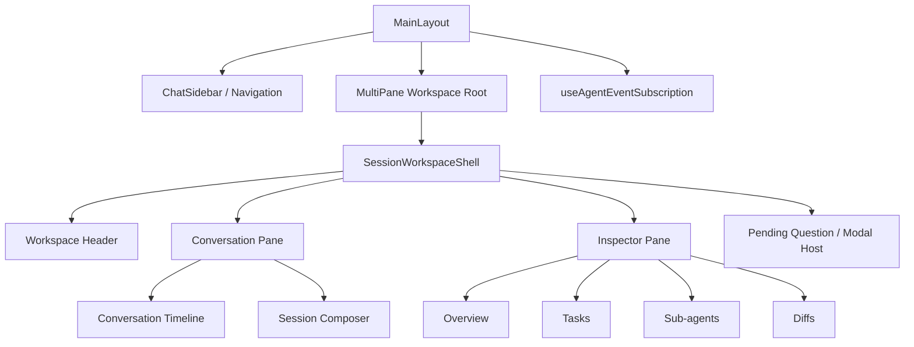

# Lotus ChatPage Frontend Refactor Plan

## Status
- **Scope**: `src/pages/ChatPage` and directly-related shell / interaction surfaces
- **Intent**: aggressive structural refactor, **not** spacing polish
- **Primary outcome**: turn ChatPage from a stacked panel page into a **Session Workspace** with clear boundaries between navigation, conversation, execution state, and inspection
- **Based on observed code**, not screenshots alone

---

## 1. Executive Summary

Lotus ChatPage has crossed the line from “chat page with a few helper widgets” into a real **agent workspace**. The current UI still organizes that complexity as:

1. top-of-page stacked cards,
2. then the message timeline,
3. then the composer.

That model no longer scales.

### What is structurally wrong now

- `ChatView` has become a **page-sized orchestrator** instead of a focused view component.
- `InputContainer` has become a **second orchestrator** for send/cancel/retry/model/reasoning/workflow/file reference/attachment/modal behavior.
- Task list, sub-agents, session summary, diffs, question dialog, plan status, token/compression indicators all compete for primary screen real estate.
- Multiple “state panels” are rendered as if they were timeline content.
- There are already signs of architectural drift / stale layers:
  - `ExecutionStatusRail` has a selector-backed model but is not wired into the rendered chat surface.
  - `useChatManager` is not part of the actual chat hot path anymore.
  - `docs/architecture/FRONTEND_ARCHITECTURE.md` no longer matches the current implementation.

### Refactor direction

Move to a 3-domain model:

1. **Navigation** — sidebar + multi-pane selection
2. **Conversation** — timeline + composer only
3. **Inspector** — tasks / sub-agents / diffs / session overview

### Non-negotiable rule after refactor

> **Only conversation events belong in the conversation timeline.**
>
> Any structured detail that needs its own scroll area or management actions goes into the inspector, not above the timeline.

---

## 2. Verified Current Architecture

### 2.1 Shell / pane composition

Observed flow:

- `src/app/MainLayout.tsx`
  - renders `ChatSidebar`
  - renders `MultiPaneChatView`
  - mounts deferred `useAgentEventSubscription`
- `src/pages/ChatPage/components/MultiPaneChatView/index.tsx`
  - owns pane splitting / focus / close / selection controls
  - embeds `ChatView` for active session panes
  - embeds `HomeDashboard` for empty panes

### 2.2 Current conversation hot path

- `src/pages/ChatPage/components/ChatView/index.tsx`
  - loads session history
  - loads shared task list
  - derives session diff summary from tool results
  - computes selection/export state
  - controls top auxiliary panels
  - hosts message list
  - hosts input dock
  - hosts scroll capsule
  - hosts question dialog
- `src/pages/ChatPage/components/ChatView/useChatViewMessages.ts`
  - groups tool call/result messages into `ToolSessionCard` entries
  - inserts compression dividers
- `src/pages/ChatPage/components/ChatView/ChatMessagesList.tsx`
  - virtualizes and renders the timeline
- `src/pages/ChatPage/components/ToolSessionCard/index.tsx`
  - renders grouped tool sessions inline in timeline

### 2.3 Current state/auxiliary panels competing for primary layout

- `src/pages/ChatPage/components/ContextBar/index.tsx`
- `src/pages/ChatPage/components/SessionSummaryCard/index.tsx`
- `src/components/TodoList/TodoList.tsx`
- `src/pages/ChatPage/components/ChatView/SubAgentsPanel.tsx`
- `src/pages/ChatPage/components/ChatView/ActiveToolMessageCard.tsx`
- `src/components/QuestionDialog/QuestionDialog.tsx` (hosted lazily from `ChatView`)

These are all useful, but they currently behave like primary content blocks rather than secondary/inspectable state.

### 2.4 Current composer hot path

- `src/pages/ChatPage/components/InputContainer/index.tsx`
  - session-scoped input state selection
  - model / reasoning effort
  - send / retry / cancel
  - workflow / command / file-reference routing
  - modal hosts
  - event listeners for focus and referenced text
  - attachment pipeline coordination
- `src/pages/ChatPage/components/MessageInput/*`
  - lower-level input UI primitives
- `src/pages/ChatPage/hooks/useChatManager/useMessageStreaming.ts`
  - execution / sync / retry / stop orchestration

### 2.5 Stable data + event contracts already in place

These are the pieces to preserve while refactoring UI:

- `src/hooks/useAgentEventSubscription.ts`
  - global SSE ingestion / reconciliation
- `src/pages/ChatPage/store/slices/executionStateSlice.ts`
  - execution convergence / pending question / running children / active tools
- `src/pages/ChatPage/store/slices/chatSessionSlice.ts`
  - sessions list / history load / message mutation / authoritative session merge
- `src/pages/ChatPage/store/slices/todoListSlice.ts`
  - shared task snapshot + incremental progress
- `src/pages/ChatPage/store/selectors/executionSelectors.ts`
  - derived execution selectors
- `src/services/chat/AgentService.ts`
  - backend contract layer

### 2.6 Confirmed stale / drift signals

- `src/pages/ChatPage/components/ExecutionStatusRail/index.tsx`
  - selector-backed UI exists, but no render site was found in the app path
- `src/pages/ChatPage/hooks/useChatManager/index.ts`
  - not used by ChatPage runtime; current usage found only in Settings
- `docs/architecture/FRONTEND_ARCHITECTURE.md`
  - documents an older architecture that no longer reflects current ChatPage composition

---

## 3. Structural Diagnosis

### 3.1 `ChatView` is too large and owns too many concerns

`src/pages/ChatPage/components/ChatView/index.tsx` currently owns:

- session loading
- task list loading
- derived diff summary
- selection/export toolbar behavior
- top auxiliary panels
- plan mode status placement
- message list rendering orchestration
- input dock orchestration
- scroll controls
- question dialog host

This file should not remain the page’s structural center.

### 3.2 `InputContainer` is a second monolith

`src/pages/ChatPage/components/InputContainer/index.tsx` mixes:

- view concerns
- execution actions
- provider/model configuration
- reasoning effort persistence
- workflow / command / file reference flows
- modal lifecycles
- input events
- attachment state

This is too much for one component boundary.

### 3.3 State panels are being rendered as first-class timeline neighbors

Tasks, sub-agents, summary, diff, context, question prompts and execution indicators are all conceptually **secondary state surfaces**, but are currently competing with the primary conversation surface.

### 3.4 Domain logic leaks into UI-heavy components

Examples:

- `SubAgentsPanel.tsx` directly executes tool actions
- `ActiveToolMessageCard.tsx` owns persisted collapse + diff state + per-file preview rendering
- `TodoList.tsx` tries to be summary + detail + progress board at once

### 3.5 The current architecture encourages more top-of-timeline stacking

Because there is no dedicated inspector surface, every new structured feature tends to become another card in or around `ChatView`.

If we keep the current structure, density problems will return even after visual cleanup.

---

## 4. Target Architecture

## 4.1 Product model

ChatPage should become a **Session Workspace** with clear primary / secondary surfaces.



## 4.2 New page rules

### Rule A — Timeline purity
Only these belong in the timeline:

- user messages
- assistant messages
- tool sessions
- system messages
- plan / question messages that are truly part of the conversation history
- streaming placeholders
- compression dividers

### Rule B — Structured detail belongs in inspector
These should **not** render as top-level stacked cards above the timeline anymore:

- task list detail
- sub-agent management list
- session diff detail
- session summary detail

### Rule C — Header contains only compact summary state
Conversation header / meta strip can show:

- workspace path
- system prompt name
- plan mode
- token/compression/truncation indicators
- task / diff / sub-agent counts

But it should stay compact and non-scroll-dominant.

### Rule D — UI components do not own execution orchestration
Execution state stays in store + event layer. UI consumes view-models / selectors.

---

## 5. File-Level Disposition Matrix

## 5.1 Shell / navigation layer

| Current file | Disposition | Why | Target |
|---|---|---|---|
| `src/app/MainLayout.tsx` | **Keep** | Correct place for app shell, sidebar, deferred SSE subscription | Keep as app shell; swap workspace root component later |
| `src/pages/ChatPage/components/MultiPaneChatView/index.tsx` | **Keep, slim** | Correct place for pane split/focus/close mechanics | Replace embedded `ChatView` with `SessionWorkspaceShell` |
| `src/pages/ChatPage/components/ChatSidebar/index.tsx` | **Keep** | Navigation layer is valid | Keep as navigation surface; no inspector logic |
| `src/pages/ChatPage/components/ChatSidebar/useChatSidebarState.ts` | **Keep, minor cleanup** | Sidebar-specific selector projection is useful | Keep as sidebar-only state adapter |
| `src/pages/ChatPage/components/HomeDashboard/index.tsx` | **Keep** | Empty-pane / new-session state is still needed | Keep |

## 5.2 Conversation layer

| Current file | Disposition | Why | Target |
|---|---|---|---|
| `src/pages/ChatPage/components/ChatView/index.tsx` | **Split aggressively, then retire** | Too many responsibilities; current structural bottleneck | Split into workspace shell + conversation + inspector host files |
| `src/pages/ChatPage/components/ChatView/ChatMessagesList.tsx` | **Keep and move** | Good focused timeline renderer | Move to `conversation/timeline/ChatMessagesList.tsx` |
| `src/pages/ChatPage/components/ChatView/useChatViewMessages.ts` | **Keep and rename** | Valuable entry-grouping adapter | Move to `conversation/timeline/useConversationEntries.ts` |
| `src/pages/ChatPage/components/ChatView/useChatViewScroll.ts` | **Keep** | Valid timeline behavior hook | Move under conversation/timeline |
| `src/pages/ChatPage/components/ChatView/scrollAnchorStorage.ts` | **Keep** | Scroll persistence is orthogonal and useful | Move under conversation/timeline |
| `src/pages/ChatPage/components/ChatView/useScrollAnchorPersistence.ts` | **Keep** | Useful behavior split | Move under conversation/timeline |
| `src/pages/ChatPage/components/ChatView/scrollAnchorRestore.ts` | **Keep** | Useful behavior split | Move under conversation/timeline |
| `src/pages/ChatPage/components/ChatView/events.ts` | **Keep** | Shared UI event constants | Move under `workspace/events.ts` or `conversation/events.ts` |
| `src/pages/ChatPage/components/MessageCard/*` | **Keep** | Message rendering layer is a stable concept | Keep, possibly move to `messages/` later |
| `src/pages/ChatPage/components/SystemMessageCard/*` | **Keep** | Still valid message subtype | Keep |
| `src/pages/ChatPage/components/PlanMessageCard/index.tsx` | **Keep** | Conversation event UI | Keep |
| `src/pages/ChatPage/components/QuestionMessageCard/index.tsx` | **Keep** | Conversation event UI | Keep |
| `src/pages/ChatPage/components/StreamingMessageCard/index.tsx` | **Keep** | Timeline streaming placeholder | Keep |
| `src/pages/ChatPage/components/ToolSessionCard/index.tsx` | **Keep, narrow scope** | Grouped tool session rendering is valuable | Timeline should show compact summary only; detail moves to inspector |
| `src/pages/ChatPage/components/ToolStepsCard/*` | **Keep, repurpose** | Good detail renderer for tools | Use more in inspector than timeline |
| `src/pages/ChatPage/components/FileChangeViewer/index.tsx` | **Keep, reuse heavily** | Strong inspector-grade diff primitive already exists | Reuse in `DiffInspectorPanel` |

## 5.3 Session state / inspector surfaces

| Current file | Disposition | Why | Target |
|---|---|---|---|
| `src/components/TodoList/TodoList.tsx` | **Replace** | Card tries to be summary + progress + detail + management surface | Replace with `TaskSummaryChip` + `TaskInspectorPanel` |
| `src/pages/ChatPage/components/TodoListDisplay/index.tsx` | **Keep for now** | Timeline-specific task-list rendering may still be needed for message history | Keep until backend event rendering model is revisited |
| `src/pages/ChatPage/components/ChatView/SubAgentsPanel.tsx` | **Split / rewrite** | Too much UI + action logic in one card | Replace with inspector panel + action hook + summary chip |
| `src/pages/ChatPage/components/ChatView/ActiveToolMessageCard.tsx` | **Split / rewrite** | Diff summary and file previews should not live above composer as large card | Replace with diff summary chip + diff inspector |
| `src/pages/ChatPage/components/SessionSummaryCard/index.tsx` | **Split / rewrite** | Summary card should become compact header stats + overview panel | Replace with session stats strip + overview inspector |
| `src/pages/ChatPage/components/ContextBar/index.tsx` | **Demote / absorb** | Good data, wrong prominence | Fold into compact conversation header/meta strip |
| `src/components/QuestionDialog/QuestionDialog.tsx` | **Keep component, move host** | Interaction modal is valid, but hosting it from `ChatView` increases shell coupling | Mount from workspace-level interaction host |
| `src/pages/ChatPage/components/ExecutionStatusRail/index.tsx` | **Deprecate or fold into header** | Has useful selector model but standalone rail is not used | Fold into compact header status pills, then remove old component |

## 5.4 Composer / input layer

| Current file | Disposition | Why | Target |
|---|---|---|---|
| `src/pages/ChatPage/components/InputContainer/index.tsx` | **Split aggressively, then retire** | Current composer orchestrator is too large and owns too many unrelated concerns | Replace with `SessionComposer` + view-model/actions + host components |
| `src/pages/ChatPage/components/InputContainer/useInputContainerCommand.ts` | **Keep, move** | Command routing logic is still useful | Move under `composer/hooks/` |
| `src/pages/ChatPage/components/InputContainer/useInputContainerWorkflow.ts` | **Keep, move** | Workflow-specific logic is valid | Move under `composer/hooks/` |
| `src/pages/ChatPage/components/InputContainer/useInputContainerFileReferences.ts` | **Keep, move** | File-reference logic is valid | Move under `composer/hooks/` |
| `src/pages/ChatPage/components/InputContainer/useInputContainerAttachments.ts` | **Keep, move** | Attachment orchestration is valid | Move under `composer/hooks/` |
| `src/pages/ChatPage/components/InputContainer/useInputContainerSubmit.ts` | **Keep, move** | Submit routing is valid | Move under `composer/hooks/` |
| `src/pages/ChatPage/components/MessageInput/*` | **Keep** | This is already closer to presentational / lower-level input UI | Keep as composer subcomponents |
| `src/pages/ChatPage/components/ProviderModelPicker/index.tsx` | **Keep** | Still needed in composer toolbar | Keep |
| `src/pages/ChatPage/components/CommandSelector/index.tsx` | **Keep** | Secondary composer surface | Keep as host-managed panel |
| `src/pages/ChatPage/components/FileReferenceSelector/index.tsx` | **Keep** | Secondary composer surface | Keep as host-managed panel |
| `src/pages/ChatPage/components/WorkspacePathModal/index.tsx` | **Keep** | Secondary composer surface | Keep as host-managed modal |
| `src/pages/ChatPage/components/WorkflowSelector/index.tsx` | **Keep** | Secondary composer surface | Keep |

## 5.5 Data / event / store layer

| Current file | Disposition | Why | Target |
|---|---|---|---|
| `src/hooks/useAgentEventSubscription.ts` | **Keep stable** | Global event ingestion and reconciliation layer must not be coupled to workspace layout rewrite | Keep in app shell |
| `src/pages/ChatPage/store/slices/executionStateSlice.ts` | **Keep stable** | Correct place for execution convergence and pending-question state | Keep; add selector adapters if needed |
| `src/pages/ChatPage/store/slices/chatSessionSlice.ts` | **Keep stable** | Correct place for sessions/history/message merge | Keep |
| `src/pages/ChatPage/store/slices/todoListSlice.ts` | **Keep stable** | Correct place for shared task snapshot state | Keep |
| `src/pages/ChatPage/store/selectors/executionSelectors.ts` | **Keep** | Good derived selector layer | Reuse in header / inspector view-models |
| `src/services/chat/AgentService.ts` | **Keep stable** | Backend contract layer should stay UI-agnostic | Keep |
| `src/services/tool/ToolService.ts` | **Keep stable** | Tool execution adapter is fine | Wrap through domain hooks instead of direct UI calls |
| `src/pages/ChatPage/hooks/useChatManager/useMessageStreaming.ts` | **Keep stable** | Execution command pipeline should stay outside presentation components | Keep |
| `src/pages/ChatPage/hooks/useChatManager/index.ts` | **Mark legacy** | Not used by ChatPage runtime anymore | Keep only for non-chat callers; remove later |
| `src/pages/ChatPage/services/AgentService.ts` | **Keep as compatibility shim for now** | Existing imports may still rely on it | Remove after import cleanup |

## 5.6 Documentation

| Current file | Disposition | Why | Target |
|---|---|---|---|
| `docs/architecture/FRONTEND_ARCHITECTURE.md` | **Supersede / update later** | Current doc describes an older architecture | Replace with updated workspace architecture after migration |
| `docs/architecture/CHATPAGE_FRONTEND_REFACTOR_PLAN.md` | **New** | Working refactor blueprint | This file |

---

## 6. Proposed Target Directory Structure

## 6.1 End state

```text
src/pages/ChatPage/
  workspace/
    SessionWorkspaceShell.tsx
    SessionWorkspaceHeader.tsx
    useSessionWorkspaceViewModel.ts
    events.ts

  navigation/
    ChatSidebar/
    HomeDashboard/
    MultiPane/

  conversation/
    ConversationPane.tsx
    ConversationMetaStrip.tsx
    timeline/
      ChatMessagesList.tsx
      useConversationEntries.ts
      useConversationScroll.ts
      scrollAnchorStorage.ts
      scrollAnchorRestore.ts
      useScrollAnchorPersistence.ts
    selection/
      MessageSelectionToolbar.tsx
    floating/
      ScrollCapsule.tsx

  inspector/
    SessionInspectorPane.tsx
    InspectorTabs.tsx
    overview/
      SessionOverviewPanel.tsx
      useSessionSummaryStats.ts
    tasks/
      TaskInspectorPanel.tsx
      TaskSummaryChip.tsx
      TaskListCompact.tsx
    agents/
      SubAgentInspectorPanel.tsx
      SubAgentRow.tsx
      SubAgentSummaryChip.tsx
      useSubAgentActions.ts
    diffs/
      DiffInspectorPanel.tsx
      DiffSummaryChip.tsx
      useSessionDiffSummary.ts

  composer/
    SessionComposer.tsx
    useComposerViewModel.ts
    useComposerActions.ts
    toolbar/
      ComposerToolbar.tsx
    hosts/
      FileReferenceSelectorHost.tsx
      WorkspacePathModalHost.tsx
      CommandSelectorHost.tsx

  messages/
    MessageCard/
    SystemMessageCard/
    ToolSessionCard/
    ToolStepsCard/
    StreamingMessageCard/
    PlanMessageCard/
    QuestionMessageCard/

  store/
    index.ts
    selectors/
      executionSelectors.ts
      sessionWorkspaceSelectors.ts
      inspectorSelectors.ts
    slices/
      chatSessionSlice.ts
      executionStateSlice.ts
      todoListSlice.ts
      sessionMetadataSlice.ts
      inputStateSlice.ts

  services/
    (stable existing services)
```

## 6.2 Migration note

Do **not** move every file immediately.

Use a wrapper strategy first:

1. create new target files,
2. re-export or delegate from old entry files,
3. migrate imports gradually,
4. remove old shells last.

This reduces import churn and keeps behavior stable during the rewrite.

---

## 7. Concrete New Files to Add First

These should be created **before** deleting or moving anything major.

### Phase-1 creation set

- `src/pages/ChatPage/workspace/SessionWorkspaceShell.tsx`
- `src/pages/ChatPage/workspace/useSessionWorkspaceViewModel.ts`
- `src/pages/ChatPage/conversation/ConversationPane.tsx`
- `src/pages/ChatPage/conversation/ConversationMetaStrip.tsx`
- `src/pages/ChatPage/conversation/selection/MessageSelectionToolbar.tsx`
- `src/pages/ChatPage/conversation/floating/ScrollCapsule.tsx`
- `src/pages/ChatPage/inspector/SessionInspectorPane.tsx`
- `src/pages/ChatPage/inspector/InspectorTabs.tsx`

### Phase-2 creation set

- `src/pages/ChatPage/inspector/overview/SessionOverviewPanel.tsx`
- `src/pages/ChatPage/inspector/overview/useSessionSummaryStats.ts`
- `src/pages/ChatPage/inspector/tasks/TaskInspectorPanel.tsx`
- `src/pages/ChatPage/inspector/tasks/TaskSummaryChip.tsx`
- `src/pages/ChatPage/inspector/agents/SubAgentInspectorPanel.tsx`
- `src/pages/ChatPage/inspector/agents/useSubAgentActions.ts`
- `src/pages/ChatPage/inspector/diffs/DiffInspectorPanel.tsx`
- `src/pages/ChatPage/inspector/diffs/useSessionDiffSummary.ts`

### Phase-3 creation set

- `src/pages/ChatPage/composer/SessionComposer.tsx`
- `src/pages/ChatPage/composer/useComposerViewModel.ts`
- `src/pages/ChatPage/composer/useComposerActions.ts`
- `src/pages/ChatPage/composer/hosts/FileReferenceSelectorHost.tsx`
- `src/pages/ChatPage/composer/hosts/WorkspacePathModalHost.tsx`
- `src/pages/ChatPage/composer/hosts/CommandSelectorHost.tsx`

---

## 8. Migration Roadmap

## Phase 0 — Freeze further layout debt

### Goal
Stop making ChatPage worse while refactor starts.

### Actions
- No new top-of-timeline panels.
- No new full-card status surfaces above the conversation.
- New structured surfaces must have **summary + inspector** forms.
- New presentational components must not call `toolService.executeTool` directly.

### Output
- Team-level guardrail for ChatPage changes.

---

## Phase 1 — Introduce Session Workspace shell

### Goal
Create the new structural boundary **without rewriting message rendering first**.

### Actions
- Add `SessionWorkspaceShell`.
- Add `ConversationPane` and `SessionInspectorPane`.
- Keep existing `ChatMessagesList` and `useChatViewMessages`.
- Keep existing old panels initially, but host them in inspector tabs instead of stacking above timeline.
- Move compact state into `ConversationMetaStrip`.

### Expected result
The page gains the correct primary/secondary layout before internal component rewrites are finished.

### Notes
This is the highest-leverage phase.

---

## Phase 2 — Break up `ChatView`

### Goal
Remove `ChatView/index.tsx` as the structural bottleneck.

### Actions
- Extract from `ChatView`:
  - `ConversationMetaStrip`
  - `MessageSelectionToolbar`
  - `ScrollCapsule`
  - question dialog host
  - inspector host wiring
- Make legacy `ChatView/index.tsx` a thin wrapper that renders `SessionWorkspaceShell`.
- Keep timeline internals stable during this phase.

### Exit criteria
- `ChatView/index.tsx` becomes a wrapper or is deleted.
- Conversation and inspector layout are no longer co-owned by one file.

---

## Phase 3 — Break up `InputContainer`

### Goal
Create a focused composer layer.

### Actions
- Replace `InputContainer/index.tsx` with `SessionComposer`.
- Split model/reasoning/config logic from visual layout.
- Keep `MessageInput/*` as lower-level presentation primitives.
- Extract modal hosts and selector hosts from main composer file.
- Keep `useMessageStreaming.ts` stable.

### Exit criteria
- `InputContainer/index.tsx` no longer owns the entire composer domain.
- Send/cancel/retry/model/reasoning/file-ref/tool/workflow responsibilities are separated.

---

## Phase 4 — Rewrite state panels for inspector-first behavior

### Goal
Replace the current heavy cards with proper inspector surfaces.

### Actions
- Rewrite tasks surface:
  - summary chip + inspector panel
- Rewrite sub-agents surface:
  - compact list + dedicated action hook
- Rewrite diff surface:
  - summary chip + inspector detail using `FileChangeViewer`
- Rewrite session overview:
  - compact stats strip + overview panel

### Exit criteria
- No more large task/sub-agent/diff/summary blocks above the timeline.

---

## Phase 5 — Dead code cleanup and documentation alignment

### Goal
Remove transitional debt.

### Actions
- Remove or fold `ExecutionStatusRail`.
- Remove deprecated ChatView wrapper once imports are migrated.
- Remove or isolate legacy `useChatManager` from chat-domain docs.
- Update `docs/architecture/FRONTEND_ARCHITECTURE.md` to match the new workspace model.

### Exit criteria
- New architecture is reflected both in code and docs.

---

## 9. Backend / Event Contracts That Must Stay Stable

The UI refactor should preserve these contract boundaries.

## 9.1 Core HTTP endpoints consumed by ChatPage

From `src/services/chat/AgentService.ts`:

- `POST chat`
- `POST execute/:sessionId`
- `GET sessions`
- `POST sessions`
- `PATCH sessions/:sessionId`
- `POST sessions/:sessionId/regenerate-title`
- `GET task/:sessionId`
- `GET history/:sessionId`
- `GET runs/active`
- `POST stop/:sessionId`
- `GET respond/:sessionId/pending` (via `agentApiClient` in `useMessageStreaming.ts`)
- `PATCH sessions/:sessionId/messages/:messageId`
- `DELETE sessions/:sessionId/messages/:messageId`
- `POST sessions/:sessionId/messages/truncate`
- `POST sessions/:sessionId/restore`

## 9.2 SSE event stream boundary

From `useAgentEventSubscription.ts` + `AgentService.ts`:

- event stream: `GET /api/v1/events/:sessionId` via `EventSource`
- important event groups consumed by frontend:
  - token / reasoning token
  - tool lifecycle
  - task list updated / delta / completed / evaluation
  - token budget / context compression
  - sub-agent lifecycle
  - pending question / respond mode
  - session metadata updates (title/pinned)

## 9.3 Stability rule

During UI refactor:

- do **not** move SSE subscription into ChatView-like view files
- do **not** collapse execution convergence logic into UI components
- do **not** make inspector own authoritative execution/session state

The store + event layer must remain the source of truth.

---

## 10. Immediate High-Priority File Attacks

If starting implementation tomorrow, attack files in this order:

### P0 — Structural bottlenecks
1. `src/pages/ChatPage/components/ChatView/index.tsx`
2. `src/pages/ChatPage/components/InputContainer/index.tsx`
3. `src/components/TodoList/TodoList.tsx`
4. `src/pages/ChatPage/components/ChatView/SubAgentsPanel.tsx`
5. `src/pages/ChatPage/components/ChatView/ActiveToolMessageCard.tsx`
6. `src/pages/ChatPage/components/SessionSummaryCard/index.tsx`

### P1 — Boundary cleanup / rehost
7. `src/pages/ChatPage/components/ContextBar/index.tsx`
8. `src/components/QuestionDialog/QuestionDialog.tsx` (hosting boundary)
9. `src/pages/ChatPage/components/ToolSessionCard/index.tsx`
10. `src/pages/ChatPage/components/ChatSidebar/useChatSidebarState.ts`

### P2 — Legacy / stale cleanup
11. `src/pages/ChatPage/components/ExecutionStatusRail/index.tsx`
12. `src/pages/ChatPage/hooks/useChatManager/index.ts`
13. `docs/architecture/FRONTEND_ARCHITECTURE.md`

---

## 11. Definition of Done for the Refactor

The refactor is not done when the page “looks cleaner”. It is done when all of the following are true:

### Product / UX
- Timeline contains conversation events only.
- Tasks / agents / diffs / overview live in inspector, not as stacked primary cards.
- Header shows compact state only.
- A user can inspect deep state without losing the main conversation thread.

### Architecture
- No new monolithic replacement for `ChatView` or `InputContainer` appears.
- `ChatView` and `InputContainer` are gone or reduced to thin wrappers.
- Presentation components no longer own domain orchestration.
- Inspector modules consume selectors / hooks rather than calling backend/tool adapters directly.

### Code health
- New shell files are small and compositional.
- Data/event layers (`AgentService`, `useAgentEventSubscription`, store slices) stay stable.
- Old stale architecture fragments are either removed or clearly marked transitional.

---

## 12. Recommended First PR Sequence

### PR 1 — Session workspace shell
- Add new workspace + inspector shell files
- Keep old content mounted through wrappers
- No behavior rewrite yet

### PR 2 — ChatView extraction
- Split selection toolbar, meta strip, scroll capsule, dialog host
- Make `ChatView` a wrapper

### PR 3 — Composer extraction
- Introduce `SessionComposer`
- Split `InputContainer`

### PR 4 — Inspector rewrite
- Replace task / sub-agent / diff / summary panels

### PR 5 — Cleanup
- Remove old wrappers / dead surfaces
- Update docs and tests

---

## 13. Final Recommendation

Do **not** treat this as a style pass.

Treat it as a controlled migration from:

- **chat page with stacked helper cards**

to:

- **session workspace with conversation + inspector + stable event/data core**

That is the only direction that will hold once Lotus keeps adding more agent-oriented capability.
